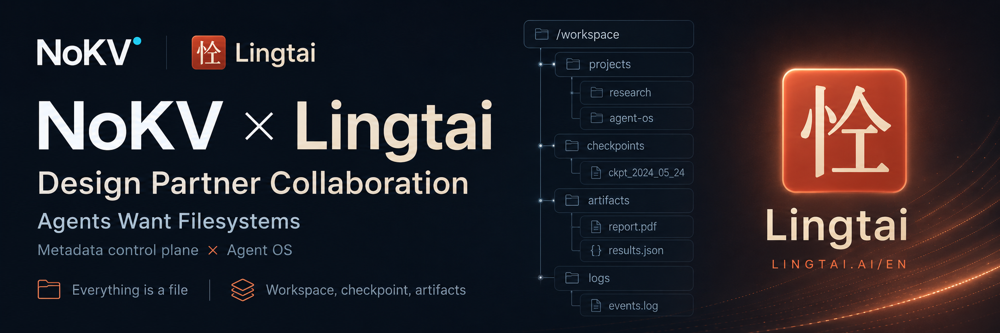

<!--
Copyright 2024-2026 The NoKV Authors.
SPDX-License-Identifier: Apache-2.0
-->

<div align="center">
  

  <p>
    <strong>Agent-native distributed workspace and artifact storage.</strong>
  </p>

  <p>
    <a href="https://nokv.io/architecture"><strong>Architecture</strong></a> ·
    <a href="./docs/workbench-contract.md"><strong>Workbench Contract</strong></a> ·
    <a href="./docs/metadata-schema.md"><strong>Metadata Schema</strong></a> ·
    <a href="./docs/development/workspace-acceptance.md"><strong>Acceptance</strong></a> ·
    <a href="https://github.com/feichai0017/NoKV/discussions"><strong>Discussions</strong></a>
  </p>
</div>

## Latest update

<div align="center">
  <a href="https://github.com/orgs/NoKV-Lab/discussions/378">
    
  </a>
</div>

> **NoKV × LingTai** is a design partner collaboration.
> [English announcement](https://github.com/orgs/NoKV-Lab/discussions/378) ·
> [中文公告](https://github.com/orgs/NoKV-Lab/discussions/380)

## What is NoKV?

NoKV is a distributed workspace and artifact store designed specifically
for Agent infrastructure. It gives datasets, scripts, logs, outputs,
checkpoints, reports, and provenance one path-shaped namespace while keeping
artifact bytes as immutable objects in S3-compatible storage.

Its product surfaces are:

- the complete 18-tool LingTai Workbench facade;
- Rust and Python Agent SDKs;
- a custom `nokv` CLI;
- MCP/Agent adapters;
- explicit materialize/collect adapters for local executables.

NoKV does **not** provide FUSE, POSIX, CSI, transparent fsspec access, or a
general NAS replacement.

## Architecture

```text
Workbench / SDK / custom CLI / MCP
  -> route one RootId to one logical metadata shard
  -> resolve a visible Workbench incarnation
  -> point-read or delimiter-scan canonical full-path keys in Holt
  -> stream immutable revision-owned blocks from S3-compatible storage
```

The lower design uses:

- `PathCurrent(root, workspace_incarnation, normalized_relative_path)` as the
  only namespace truth;
- implicit directories and five virtual Workbench sections;
- immutable `ArtifactRevisionId` bodies and whole-body digests;
- object keys owned by logical shard, root, and revision;
- atomic object-first, metadata-last publication;
- exact strong revision references with an epoch-fenced GC state machine;
- leased MVCC snapshots for short recovery;
- sealed commits/tags with exact revision retention for long-lived reuse;
- same-root restore into a fresh hidden incarnation;
- persisted root-affinity placement and physical-owner epoch fencing.

Holt is the ordered shard-local metadata engine. It provides point reads,
component-safe delimiter scans, atomic named-tree batches, WAL, checkpoints,
and recovery primitives. The current runtime acknowledges only after a
synchronous shard-local Holt WAL write; NoKV checkpoint export/install,
remote outbox consumption/replay, shared-log acknowledgement, and fsck are not
yet wired. Each local mutation does atomically append canonical hash-chained
replay material inside the same Holt store, but that is not shared durability.
A non-empty Control recovery frontier therefore fails startup
closed instead of being advertised as recovered. The local-WAL profile admits
only a first-owner create or an exact current-lease resume against the existing
store; successor acquisition is refused until verified checkpoint/log recovery
exists. Holt layout never leaks into the SDK or Workbench contract.

## Stable Workbench

NoKV exposes exactly these 18 Workbench tools:

```text
workbench_create
workbench_put_file
workbench_append
workbench_edit
workbench_list
workbench_stat
workbench_read
workbench_grep
workbench_search
workbench_aggregate
workbench_catalog
workbench_find
workbench_commit
workbench_snapshot
workbench_snapshot_renew
workbench_snapshot_retire
workbench_snapshot_list
workbench_restore
```

Tool names, normalized input schemas, create/replace semantics, generation and
digest relationships, commit identity, snapshot lifecycle, and restore
idempotency form the stable contract. Workbench result shaping remains an
adapter concern and does not dictate durable metadata families.

See [Workbench Contract](docs/workbench-contract.md).

## First client

The first client validates a scientific reconstruction workflow:

```text
upload dataset
  -> seal immutable input commit/tag
  -> run multiple Workbenches against the same input
  -> materialize verified files for the local executable
  -> collect declared outputs/logs/run metadata
  -> commit lineage
  -> query, compare, snapshot, and restore
```

Materialization creates a disposable local sandbox; it is not a NoKV namespace
or host-filesystem access path.

## Architecture contract

The workspace architecture is NoKV's only namespace, metadata, routing, and
object-lifetime contract. Every supported route uses the `nokv_workspace`
schema marker, full-path namespace, revision-owned objects, persisted root
placement, and owner fencing. Startup rejects an unmarked, unknown, or mixed
store.

Filesystem frontends, inode/dentry namespace models, path-prefix shard routing,
and historical benchmark/demo profiles are outside the NoKV product contract
and must not drive behavior.

## Documentation

- [Product Design](docs/product-design.md)
- [Architecture](docs/architecture.md)
- [Workbench Contract](docs/workbench-contract.md)
- [Metadata Schema](docs/metadata-schema.md)
- [Object Layout](docs/object-layout.md)
- [Benchmarks](docs/benchmarks.md)
- [Workspace Acceptance](docs/development/workspace-acceptance.md)
- [Path-Native Metadata Comparison](docs/development/path-native-metadata-comparison.md)
- [Code Contract](docs/development/code_contract.md)
- [PR Review Checklist](docs/development/pr_review_checklist.md)
- [LingTai Workbench Setup](docs/lingtai-workbench-preflight.md)

## Development

Before substantial changes:

```bash
cargo fmt --all -- --check
cargo clippy --workspace --all-targets -- -D warnings
cargo test --workspace
python3 scripts/lingtai-workbench/workbench_contract_test.py
git diff --check
```

Read [CONTRIBUTING.md](CONTRIBUTING.md) and the
[code contract](docs/development/code_contract.md) before editing package
boundaries or durable storage.

## Recognition

- [CNCF Landscape](https://landscape.cncf.io/?group=projects-and-products&item=runtime--cloud-native-storage--nokv)
- [DBDB.io](https://dbdb.io/db/nokv)

## License

Apache-2.0. See [LICENSE](LICENSE).
