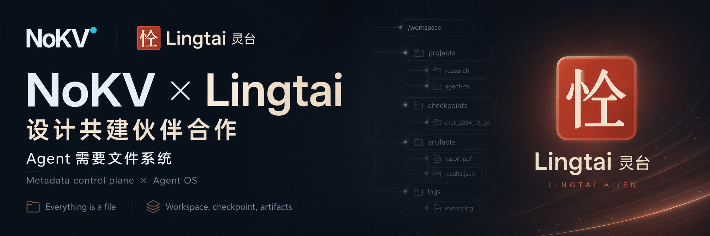
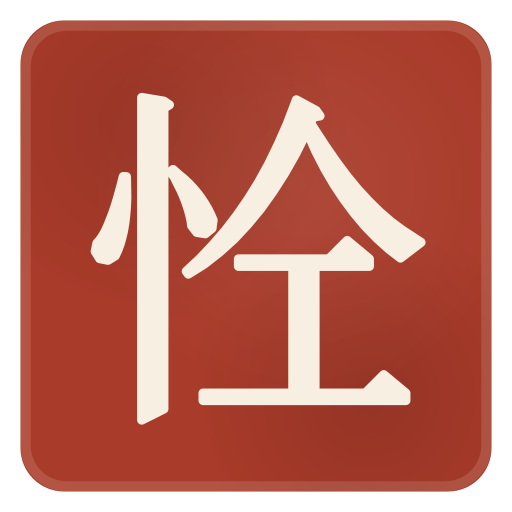

  

# NoKV × LingTai：design-partner 合作正式启动

> 状态说明：本文记录合作启动时的背景。当前集成以完整的
> [Workbench 契约](../workbench-contract.md)为边界，
> 优先通过原生全量 CLI，其次通过 Python SDK；仅在 host 明确需要时
> 使用可选的 MCP sidecar。三者使用同一套 NoKV workspace 格式，
> 不把 NoKV 作为 FUSE/POSIX mount；参见[产品设计](../product-design.md)。
>
> 2026-08 更新：本文提到的可选 Workbench MCP sidecar 已废弃，不是受支持的
> NoKV 接入面。稳定边界过去是、现在仍然是 18-tool Workbench 语义契约，
> 经由原生全量 CLI 与 Python SDK 使用。以下正文按发布原文保留。

本文记录 **NoKV** 与 **LingTai**（[Lingtai-AI/lingtai](https://github.com/Lingtai-AI/lingtai)）启动 **design-partner（设计共建伙伴）合作**的起点。

## 两个项目，一个共同工作流

- **LingTai（灵台）** 是 local-first 的 Agent 运行时，以路径形态的本地文件组织状态、信箱、日志与产物。
- **NoKV** 是分布式 Agent workspace 与 artifact store；默认由下游 skill 调用原生全量 CLI，嵌入式调用使用 Python SDK，需要 MCP transport 的 host 才启用可选 sidecar。NoKV 使用 Holt 保存规范化元数据，并把不可变内容存入 S3 兼容对象存储。

双方的集成点是 Workbench 契约，而不是共享 host-filesystem namespace。LingTai 负责本地运行时布局；NoKV 负责分布式 artifact 身份、发布、发现与恢复语义。

## 我们正在一起构建什么

合作重点包括：

- **恢复与长期复用**：leased snapshot 用于短期恢复，immutable commit/tag 用于长期保留，restore 创建新的 Workbench。
- **原子、崩溃一致的发布**：并发的 agent 写入，或运行中途崩溃，都不会留下写到一半的工作区。
- **工件溯源（artifact provenance）**：带摘要（digest）的版本化数据块，让每一个派生工件都能追溯到产生它的那次运行。
- **可查询的元数据层**：在 agent 的产物之间提问 *“这是什么产生的 / 什么依赖了它”*。

上层路径语义保持稳定，同时明确存储边界。需要本地文件的可执行程序通过 materialize/collect adapter 交互；临时 sandbox 不是 NoKV namespace truth。

## 当前方向

稳定边界是完整的 18-tool Workbench 语义契约，而不是 MCP transport 本身。接入顺序是原生全量 CLI 优先、Python SDK 其次、MCP sidecar 可选。NoKV 保留面向 Agent 的路径形态语义，以 Holt 中的规范化全路径元数据和 S3 兼容对象存储中的不可变工件 revision 作为底层实现。LingTai 是当前活跃的 design partner 与首个 client 集成。

如果“一个有状态、可快照、可审计的 Agent 工作区”正是你一直想要的：给 NoKV 点个星，关注 [LingTai](https://github.com/Lingtai-AI/lingtai)，留意后续。

## 联系方式

- NoKV：hello@nokv.io
- LingTai：lingtai2026@gmail.com

## 加入社群

- Discord（NoKV）：https://discord.gg/c5PZapnwPh
- Slack（NoKV）：CNCF 社区 Slack 中的 NoKV 频道（先在 https://slack.cncf.io 加入，再进频道 https://cloud-native.slack.com/archives/C0BBDBYE3H6 ）
- 微信群（LingTai）：请发送邮件到 `lingtai2026@gmail.com` 获取社群信息
