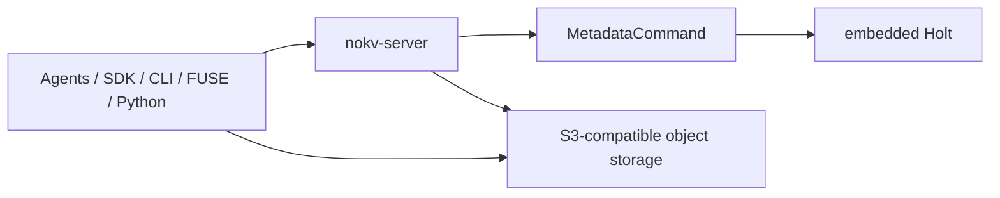
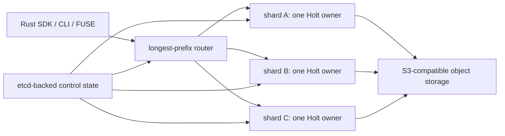

<!--
Copyright 2024-2026 The NoKV Authors.
SPDX-License-Identifier: Apache-2.0
-->

# Architecture

NoKV is a metadata control plane for agent workspaces. It presents a
filesystem-shaped namespace, stores namespace state in the embedded Holt
metadata engine, and stores immutable file bodies in S3-compatible object
storage.

The default deployment is one `nokv-server` with one embedded Holt store. The
current `main` branch also includes an **experimental** path-sharded fleet: a
router maps path prefixes to independent Holt-backed shard owners, with one
active writer per shard. This is horizontal sharding, not consensus
replication, and it is not yet a production-HA claim.

## Product Boundary

```text
Agents / RAGFS / SDK / CLI / FUSE / Python
                    |
                    v
          NoKV metadata service
  namespace, publication, snapshots, watches,
     CoW bindings, provenance metadata, GC
                    |
          +---------+---------+
          |                   |
          v                   v
  embedded Holt         S3-compatible store
  metadata truth        immutable file bodies
```

NoKV owns:

- inode/dentry namespace truth and derived path indexes;
- `MetadataCommand` validation and shard-local crash-atomic application;
- versioned body descriptors and publication ordering;
- snapshot, watch, CoW binding, history-retention, and object-reference GC
  policy;
- path routing, shard ownership, and recovery coordination in fleet mode.

The object provider owns the physical durability, replication, availability,
and access policy of file bodies. NoKV records logical reachability and decides
when an object is eligible for deletion, but it does not replace the provider's
durability or IAM guarantees.

## Layers and Package Ownership

```text
Application surfaces
  nokv-agent      transport-free read-only agent tool contracts
  nokv-client     Rust path/file SDK and fleet-aware metadata client
  nokv-python     Python/fsspec binding over one metadata endpoint
  nokv-fuse       low-level FUSE frontend
  nokv            CLI and MCP/workbench transport wiring

Metadata service
  nokv-types      storage-neutral namespace and shard types
  nokv-protocol   framed metadata RPC DTOs
  nokv-meta       schema, commands, Holt binding, snapshots, GC, CoW
  nokv-control    shard map, leases, epochs, recovery pointers
  nokv-server     RPC service, shard slots, ownership and recovery workers

Body storage
  nokv-object     S3-compatible storage and optional local hot tier
```

Holt remains embedded and shard-local. It supplies ordered metadata storage,
atomic batches, WAL/checkpoint recovery, and prefix/range iteration. Holt does
not own fleet routing, distributed consensus, object storage, filesystem
semantics, or tenant policy.

## Default Single-Node Path

In the default configuration, one long-running `nokv-server` owns the namespace
and opens one Holt metadata store. The Rust SDK, CLI, FUSE frontend, MCP
profiles, and Python binding connect to that service. HTTP is used for health,
status, and control endpoints; namespace operations use the framed metadata RPC.



Single-node operation is the supported default. It does not provide metadata
replication: the active Holt store is the local authority. Metadata checkpoint
archives reduce disaster-recovery exposure but are not a continuously
replicated metadata service.

## Publication and Read Paths

Artifact publication separates body transfer from namespace visibility:

```text
1. Upload immutable object blocks.
2. Build a versioned body descriptor.
3. Submit one MetadataCommand to the owning shard.
4. Atomically publish inode/dentry/index/watch changes in that shard.
5. Reclaim unreachable staged blocks only after an authoritative rejection
   or through the object-reference GC policy.
```

If a connection fails after step 4, the caller may not know whether the command
committed. It must reconcile the request result instead of blindly deleting
staged objects.

Reads obtain a generation-scoped layout plan and fetch immutable byte ranges
from the configured object backend. Full-path indexes accelerate agent and
artifact queries, but inode/dentry records remain canonical namespace truth.

## Consistency Boundary

| Operation | Current guarantee |
| --- | --- |
| One `MetadataCommand` | Crash-atomic within its owning Holt shard |
| Artifact publication | Old generation or new generation is visible within the owning shard |
| Same-shard rename | Atomic |
| Cross-shard rename/batch | Rejected; no distributed transaction |
| One live read | Resolved against the state observed by that operation |
| Multiple stable reads | Pin and reuse one snapshot |
| Snapshot retention | Protected while its lease/binding remains valid |
| Path-scoped workspace | Namespace confinement, not authentication or RBAC |

NoKV does not claim that arbitrary repeated reads of the live namespace form a
global serializable transaction. A snapshot is the explicit stable-view
primitive.

## Snapshots, CoW, and Recovery

A snapshot records a version frontier and retention pin. Reads using the same
snapshot observe one historical view while the live workspace continues to
change. Snapshot protection is leased unless another durable binding retains
the referenced history.

CoW workspace operations share immutable body blocks and create independent
namespace state. The preferred agent recovery flow is:

```text
snapshot -> restore into a new same-shard workspace fork -> validate -> switch
```

This keeps the source workspace unchanged. CoW avoids copying body bytes, but
metadata work can still scale with the number of namespace entries. It is a
version and namespace-isolation mechanism, not a security tenant boundary.

## Experimental Path-Sharded Fleet

Fleet mode partitions the namespace by longest matching path prefix. Each route
resolves to a shard id and one active Holt-backed owner. Cross-shard grafts let
clients present those routes as one namespace without introducing a
cross-shard transaction protocol.



The optional etcd backend stores small control-plane state: shard routes,
leases, ownership epochs, and recovery pointers. It does not replicate inode,
dentry, watch, snapshot, or GC truth. A monotonic epoch and local lease deadline
fence stale owners at the metadata commit boundary.

Fleet routing currently exists in the Rust client, CLI, server, and FUSE path.
The Python binding accepts one `metadata_addr` and is not fleet-aware.

### Recovery Modes

Metadata checkpoint publication is object-first and pointer-second:

```text
Holt checkpoint image -> immutable object
CURRENT pointer       -> published after the image is durable
```

The experimental synchronous shared-log mode archives logical
`MetadataCommand` segments. For an acknowledged operation, the relevant order
is:

```text
1. apply the command to the owning Holt store;
2. archive the logical command segment;
3. publish the recovery pointer;
4. return a successful RPC acknowledgement.
```

If archival or pointer publication fails after Holt apply, the RPC reports an
uncertain committed result rather than pretending the operation did not happen.
A replacement owner restores a checkpoint image and replays eligible logical
segments while enforcing request deduplication and the new ownership epoch.

The repository has local multi-process smoke tests for routing, owner death,
epoch-fenced failover, replay, and stale-owner rejection. These tests do not
yet cover a production multi-machine topology, network partitions, automated
operations, or enterprise throughput. Any zero-RPO statement must be limited to
successfully acknowledged operations under the tested recovery model.

## Data Fabric

Metadata records durable block identity and an S3-compatible object key. Local
NVMe paths, cache slots, and peer locations are soft placement state and must
not become namespace truth.

`nokv-object` includes a local hot-tier store, a hot-first/cold-fallback tiered
store, batched range fetches, and cache metrics. These are library-level data
path components, not a deployed cache-agent service. A hot-tier miss or failure
falls back to the durable object key when the configured provider is available.

## Capability Status

| Current default | Experimental on `main` | Next / hardening |
| --- | --- | --- |
| Single server with embedded Holt | Longest-prefix path sharding | Multi-machine chaos and operations |
| Rust SDK, CLI, FUSE, Python/fsspec | Fleet-aware Rust/CLI/FUSE routing | Python fleet routing |
| Versioned object publication | etcd lease and epoch fencing | Online reshard and live migration |
| Snapshots and leased retention | Checkpoint + logical shared-log recovery | Production metadata HA qualification |
| Same-shard CoW clone/restore | Local multi-process fleet smoke | Cross-shard query/transaction design |
| Typed watches and object-reference GC | One active writer per shard | Tenant identity, policy, and workspace freeze |
| S3-compatible body storage | Library-level local hot tier | CSI and cache-agent deployment |

## Known Limits

- No consensus-replicated metadata and no production metadata HA guarantee.
- No cross-shard transaction; path-pair operations can return `EXDEV`.
- No online resharding or live subtree migration.
- No federated `find`, `aggregate`, or recursive `grep` across independent
  metadata shards.
- No Python fleet routing.
- No NoKV-enforced tenant identity, RBAC, TLS policy, or live-workspace freeze.
- POSIX behavior is intentionally incomplete and still being hardened.
- Enterprise small-file throughput and multi-machine failure behavior have not
  yet been qualified against partner workloads.

For operational details, see
[Metadata Sharding and Recovery](./metadata-sharding-and-recovery.md) and the
[Experimental Multi-Shard Fleet Runbook](./multishard-fleet-runbook.md).
