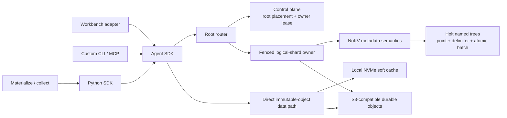
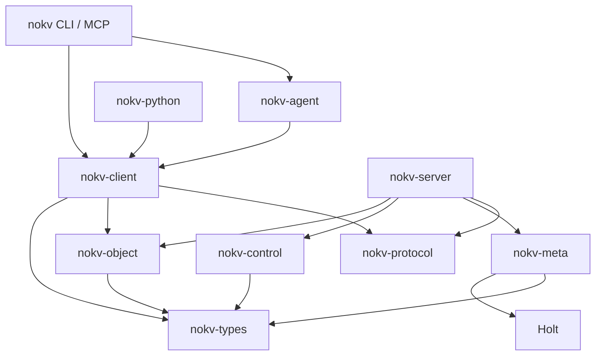
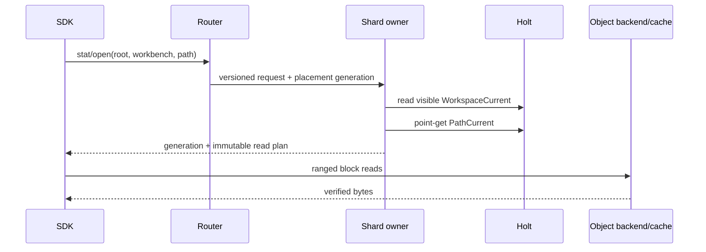
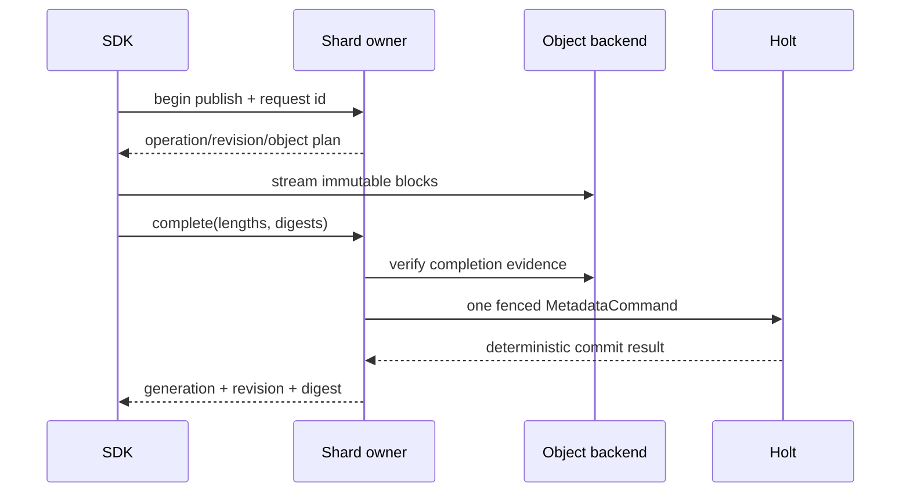
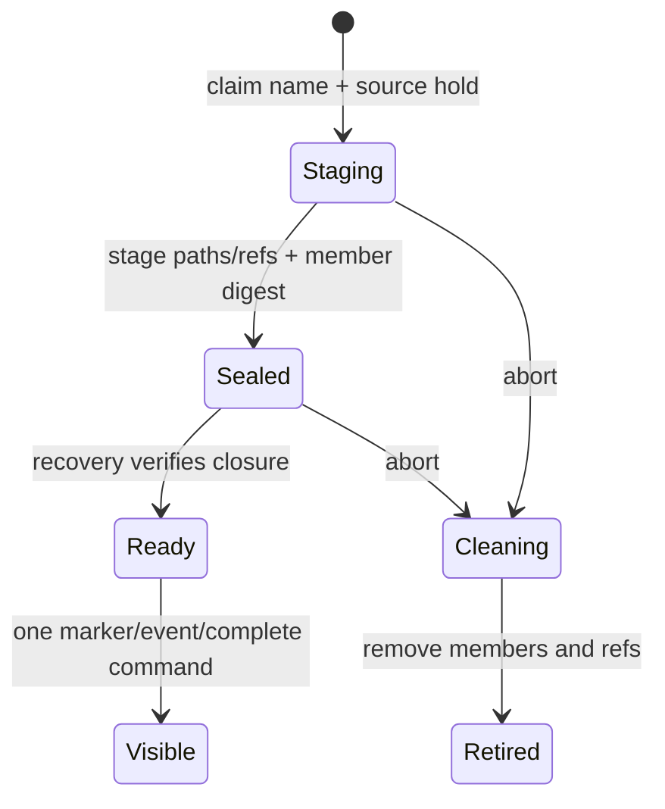

<!--
Copyright 2024-2026 The NoKV Authors.
SPDX-License-Identifier: Apache-2.0
-->

# Architecture

Status: normative workspace architecture.

## System Shape



The metadata and object paths are separate. Small control and namespace records
go through the shard owner. Clients stream immutable blocks directly through
the object boundary after receiving a revision/upload plan.

FUSE, POSIX, CSI, and fsspec are not architecture layers.

## Package Direction



Arrows point from a consumer to its dependency. The
[code contract](./development/code_contract.md) is normative.

Key constraints:

- types and protocol are storage-neutral;
- metadata owns durable semantics and Holt layout;
- control owns root placement and owner fencing, not path semantics;
- object owns provider I/O, not reachability;
- client uses protocol/routing and never imports meta/server;
- Agent adapters shape tools over SDK traits and remain transport-free;
- CLI and MCP are thin wiring.

## Identity And Namespace

```text
RootPlacement(root_id)                    control-plane truth
RootFence(root_id)                        installed shard-local fence

WorkspaceCurrent(root_id, workbench_id)
  -> incarnation, revision, lifecycle

WorkspaceIncarnationClaim(root_id, incarnation)
  -> stable workbench_id; permanent and never reused

PathCurrent(root_id, incarnation, path)
  -> generation, immutable revision, body/manifest digests, size,
     dependency bounds, content type, typed projection
```

`PathCurrent` is the only namespace truth. Workbench names are separated from
path keys by a never-reused incarnation. This prevents a failed restore or
retired Workbench's rows from appearing under a later claim.

Paths are exact case-sensitive UTF-8. The physical codec adds one to each UTF-8
byte, separates components with NUL, and ends an exact key with marker `0x01`.
This reserves both markers, places a child's delimiter rollup before its exact
artifact and both before longer siblings, and prevents an exact key from being
a strict prefix of another valid path key. The same normalizer/codec owns
storage keys, request identities, index identities, and restore member ids.
System format version 8 gates this layout.

Directories are implicit. The Workbench root and five standard sections are
virtual. A file stat is a point read; an implicit-directory stat is a prefix
existence check.

See [Metadata Schema](./metadata-schema.md) for byte-level and state-machine
rules.

## Read Path



A valid cached Workbench marker can avoid its routing/lookup work, but the
client still uses generation/version validation. The authoritative artifact
lookup is one Holt point read and does not follow the revision-lifetime row.
For a live exact get, the owner, root fence, and current version are validated
once around the dependent marker and path reads. A direct-child list replaces
the path lookup with one ordered prefix-scan path whose common-prefix rollups
are first-class implicit-prefix page items; a recursive list uses the same
prefix without delimiter rollup. One protocol page may use multiple bounded
Holt cursor scans of at most 255 logical items each when its requested limit is
larger. The metadata listing may merge an exact-prefix point read only after
descendant EOF, while the Workbench adapter exposes only direct children and
drops that self row.
There is no per-entry metadata fanout. The returned cursor is bound to the
workbench scope, read view, read version, and child anchor. Resuming after
live-state drift fails closed;
an initial bounded collection may restart in full but never merges versions.
The breaking ordered-list response is gated by protocol schema
`nokv.workspace.rpc.v2`; there is no legacy response decoder.

Secondary-index queries run at one read version and filter every result by the
matching visible incarnation. Object bodies are read only when the selected
tool actually requires them.

## Publish Path



The command validates schema, local root fence, owner epoch, request id,
workspace/path generations, and revision reference state before applying any
mutation. It atomically publishes:

- the revision and block manifest;
- the new path and workspace revision;
- strong-reference changes;
- secondary indexes;
- one typed event;
- GC candidacy for a replaced revision;
- the deterministic replay result.

Failed uploads never become visible. Response loss after commit returns the
same result on retry. Generic random writes are absent; append is immutable
segment publication plus stream-head CAS.

Commit replay resolves its deterministic build-operation identity before any
live workspace lookup. A terminal retry authenticates the complete stored
request and commit-owned run-manifest binding, then verifies the corresponding
durable publish-operation result. Consequently a later replacement head cannot
change the result of retrying an older exact commit.

The durable request also stores a domain-separated digest of every caller-known
run-manifest projection input except the owner-supplied commit time. Recovery
checks that digest before rebuilding or publishing a manifest, including while
the commit is still Running and has no staged-manifest binding.

## Revision Ownership

```text
nokv/artifacts/{logical_shard_id}/{root_id}/{artifact_revision_id}/blocks/{object_index}
```

Revision ids never name a physical owner. A process owner may change while
logical-shard/root/revision identity stays stable.

Every current path and durable commit has an exact `RevisionRef`. A revision
that reuses older blocks has a sealed dependency reference to each distinct
owner revision. The child revision stores a strong-reference count and epoch:

```text
reference add/remove
  -> mutate RevisionRef
  -> update count
  -> increment epoch
  -> if count == 0, create candidate(epoch, last_zero_version)
```

GC claims only the current zero-count epoch and atomically moves the revision
from `Available` to `Deleting`. New references require `Available`, closing the
restore/commit-versus-delete race.

## Snapshot And Commit Reads

Holt's MVCC/view substrate supports two different products:

- a leased snapshot creates a `HistoryHold(read_version)`;
- a durable commit scans under a temporary `HistoryHold`, writes an ordered
  tree manifest, adds exact commit revision refs, verifies closure seals, then
  releases the history hold.

The snapshot reaper and renew operation race through one durable lifecycle CAS.
Once `ReapClaimed` wins, the history hold is gone and renewal fails.

Commits do not pin global history. Tags are CAS-protected names for commits.
Commit retirement is explicit and checks all heads, tags, leases, lineage
children, and restore/fork consumers.

## Restore

Restore uses an operation-owned fresh Workbench incarnation:



Staged paths have strong references but no visible marker. Root-wide query and
watch surfaces therefore cannot leak them. The final command verifies the exact
incarnation and member seal, publishes it, completes the operation, emits one
event, and releases the source hold.

Restore copies O(entries) metadata and zero object bytes inside one root/shard.
NoKV deliberately avoids a lazy overlay that would tax every later read/list.

## Sharding And Ownership

The control plane persists placement before a root's first write:

```text
RootId -> immutable LogicalShardId
LogicalShardId -> current physical owner, lease, epoch
```

The owner installs/validates `RootFence` locally and checks its lease/epoch at
the Holt commit boundary. Placement is never inferred from a path or modulo
the number of owners.

A hot root's logical shard may be assigned to a dedicated physical process.
That is owner movement, not a change to logical shard or object keys.

One root is not split across logical shards. Cross-shard operations fail before
partial work.

## Recovery And Durability

Each production profile names its acknowledgement boundary:

```text
local
  ACK after shard-local Holt WAL boundary

durable distributed
  ACK after the configured shared logical-log boundary
```

The two modes have separate SLOs and benchmark rows. Recovery uses checkpoint
images plus the logical command log. Owner epoch prevents an old process from
committing or deleting objects after failover.

Current implementation status: only the `local` boundary is executable, using
synchronous shard-local Holt WAL plus an in-store atomic, hash-chained recovery
outbox. Remote outbox consumption/ACK, shared-log replication, checkpoint
installation/replay, and fsck remain qualification work. Until those are
implemented and verified, bootstrap rejects any non-zero or referenced Control
recovery frontier before acquiring an owner or installing a route; it cannot
mark such a shard `Serving` from an arbitrary local directory. Even while the
frontier is empty, the local-WAL profile permits only first-owner `Create` and
exact current-lease `Resume` with `Reopen`; it refuses every successor
acquisition rather than risk serving a replacement empty Holt store.

Durable ledgers, not object listing, recover:

- staged/multipart uploads;
- commit construction;
- restore staging and cleanup;
- GC claims and ambiguous deletes.

The required fsck recomputes reference counts and closure seals from metadata;
source or design text alone is not fsck evidence.

## Architecture Acceptance

The architecture is accepted as one system, not as independent storage
experiments. The required evidence covers:

1. namespace point reads, delimiter scans, conflict handling, and command
   amplification across the declared workload matrix;
2. revision-owned publication, visibility, lifecycle, references, GC, and
   recovery;
3. protocol, server, SDK, CLI, MCP, control routing, and lifecycle workers on
   the same schema and identity model;
4. owner failover, checkpoint/log recovery, ambiguous provider outcomes, and
   live Workbench workflows;
5. the complete [acceptance plan](./development/workspace-acceptance.md),
   with each applicable gate reported as `PASS`, `FAIL`, or `NOT QUALIFIED`.
