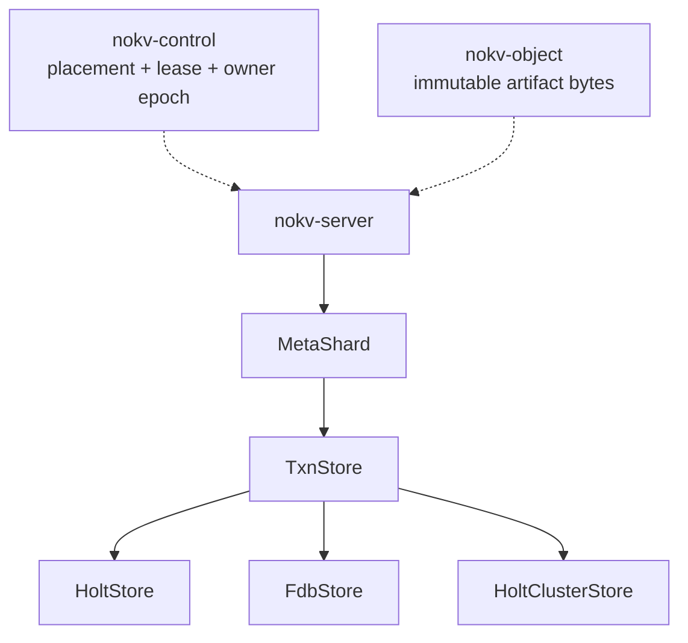
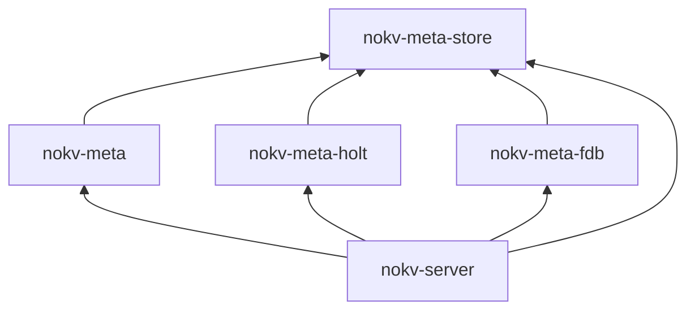

<!--
Copyright 2024-2026 The NoKV Authors.
SPDX-License-Identifier: Apache-2.0
-->

# Metadata Store Interface

Implemented: the storage-neutral interface, local Holt adapter, and `MetaShard`
cutover. The serving local profile uses Holt through `TxnStore`. Pending:
FoundationDB, replicated Holt, provider-neutral runtime admission, and
owner-safe response delivery.

The [code contract](./code_contract.md), [architecture](../architecture.md),
and [metadata schema](../metadata-schema.md) remain normative.

## Decision

NoKV separates workspace metadata semantics from the ordered transaction store
that persists metadata records.

`nokv-meta` owns one `MetaShard` domain object for each `LogicalShardId`.
`MetaShard` executes commands, maintains history, enforces fences, and manages
workspace lifecycle state. It persists records through an injected
`TxnStore`.

`TxnStore` exposes consistent reads and conditional atomic writes over
ordered byte keys. Holt, FoundationDB, and a future Holt cluster can implement
this interface without duplicating workspace state machines.

NoKV uses statically linked adapter crates. It does not load dynamic plugins or
shared-library ABIs.

## Product Boundary

This decision changes internal metadata storage and server assembly. It does
not change:

- the 18-tool Workbench contract
- Rust or Python SDK semantics
- CLI or MCP behavior
- protocol request and response semantics
- the path-native `PathCurrent` namespace
- immutable artifact storage
- root placement in `nokv-control`

FUSE, POSIX, CSI, inode, and dentry behavior remain outside the product.

## Implemented Boundary

The cutover split the former combined metadata implementation into three
responsibilities:

- `nokv-meta` validates and executes workspace commands, owns the schema, and
  writes logical recovery records.
- `nokv-meta-store` defines ordered reads, checked atomic writes, store limits,
  acknowledgement boundaries, recovery authority, and physical errors.
- `nokv-meta-holt` maps the neutral requests to Holt trees, views, atomic
  batches, WAL acknowledgement, reopen, poison handling, and diagnostics.

`bootstrap_shard` opens one `MetaShard` for a logical-shard owner and attaches
all Active roots found at startup. The server constructs the Holt adapter and
injects it as `Arc<dyn TxnStore>`. `nokv-meta` has no production Holt import.
Its dev-only workspace tests compose the Holt adapter through test support.

Logical read counters remain in `nokv-meta`. Holt cursor and database
diagnostics, session ownership, and physical counter mapping live in
`nokv-meta-holt`. Diagnostic callers retain typed handles to both layers. The
storage-neutral `TxnStore` interface does not expose adapter statistics.

## Runtime Shape



One process can own several logical shards. One logical-shard owner can attach
several roots. All attached roots share the same `Arc<MetaShard>`.

## Names

Implemented and reserved names are:

| Responsibility | Name | Status |
| --- | --- | --- |
| One logical metadata shard | `MetaShard` | Implemented |
| Ordered transaction store interface | `TxnStore` | Implemented |
| Embedded Holt implementation | `HoltStore` | Implemented |
| FoundationDB implementation | `FdbStore` | Reserved |
| Replicated Holt implementation | `HoltClusterStore` | Reserved |
| Workspace metadata error | `MetaError` | Implemented |
| Physical store error | `StoreError` | Implemented |
| Store selection | `StoreConfig` | Reserved |
| Namespace open mode | `OpenMode` | Implemented for Holt |

`Meta` names NoKV workspace semantics. `Store` names a physical ordered
transaction store. Identity and fence types retain their full names, including
`LogicalShardId`, `OwnerEpoch`, and `ReadVersion`.

Core interfaces do not use `Plugin`, `Manager`, `Provider`, `Engine`,
`Common`, or `Utils`.

## Package Direction

The target packages and dependencies are:



`nokv-server` composes `nokv-meta` with one configured adapter.

The exact dependency rules are:

- `nokv-meta-store` does not depend on `nokv-meta`, Holt, FoundationDB, or the
  server
- `nokv-meta` production code depends on `nokv-meta-store`, not Holt. Dev-only
  workspace tests can compose a qualified adapter through test support
- `nokv-meta-holt` depends on `nokv-meta-store` and Holt
- `nokv-meta-fdb` depends on `nokv-meta-store` and the selected FoundationDB
  Rust binding
- store adapters do not depend on `nokv-meta` or know workspace record types
- `nokv-server` is the only production composition root

The interface package owns storage-neutral keyspace identifiers, read and write
request types, store limits, profiles, and errors.

## Schema Ownership

`nokv-meta` owns the single `nokv_workspace` schema, including the family map,
key and value codecs, schema marker, and state machines. It sends keyspace
identifiers and encoded bytes through `TxnStore`.

An adapter maps each keyspace to a Holt tree, FoundationDB subspace, or
replicated state-machine namespace. It must not define another record layout,
schema version, migration path, or workspace codec. Every adapter must enforce
the same format marker and schema gate through `MetaShard`.

## Store Interface

The runtime interface uses owned requests. It does not expose a transaction
closure or a transaction session that survives one call.

```rust
pub trait TxnStore: Send + Sync {
    fn profile(&self) -> StoreProfile;

    fn read(&self, batch: ReadBatch) -> Result<ReadSnapshot, StoreError>;

    fn commit(&self, txn: WriteTxn) -> Result<Commit, StoreError>;

    fn ready(&self) -> Result<(), StoreError>;
}
```

The first interface is synchronous because the current metadata, executor, and
server call graph is synchronous.

The Holt cutover did not include a full-stack async refactor. Before
FoundationDB qualification, a separate breaking change will make `TxnStore`,
`MetaShard`, and the server path async. It will replace the synchronous
interface instead of keeping two variants.

## Read Contract

`ReadBatch` contains point reads and bounded ordered prefix reads.
`ReadSnapshot` returns one result for each request. Every batch is linearizable
and observes one consistent store snapshot.

All reads in one batch must observe one consistent store snapshot. A scan
must support:

- one keyspace and one byte prefix
- an empty prefix to select the full keyspace
- an exclusive `after` cursor that is a canonical output key
- positive row and byte limits
- optional delimiter grouping
- lexicographic byte ordering
- early termination when either page limit is full

Each returned record or common prefix counts against the limit. The store must
not materialize the complete prefix before it applies the cursor and limit.
`ScanPage::more` states whether the store stopped before it reached the end of
the prefix. The final item on any page that sets `more` supplies the next
`after` cursor. Callers do not infer end of scan from a short page.

The scan byte limit counts each returned key and value. A common prefix counts
only its returned key bytes. The requested limit must allow one maximum-size
row so every valid row can make progress.

`MetaShard` may issue several bounded batches to reconstruct a historical view.
It must not ask an adapter for an unbounded historical scan.

Separate read calls do not share a physical snapshot. Each historical page
must read the domain commit clock in the same batch as its rows.

If the clock differs from the first page, `MetaShard` discards every collected
page and restarts the reconstruction. The applicable snapshot or history hold
must also prevent GC from removing the requested version during that work.

NoKV `ReadVersion` remains a domain version. A store must not expose Holt
record versions, FoundationDB versions, or consensus log indexes as a NoKV
read version.

## Write Contract

`WriteTxn` contains checks and mutations:

```rust
pub struct WriteTxn {
    pub checks: Vec<Check>,
    pub mutations: Vec<Mutation>,
}

pub enum Check {
    Value {
        key: Key,
        expected: Vec<u8>,
    },
    Absent {
        key: Key,
    },
    EmptyPrefix {
        keyspace: Keyspace,
        prefix: Vec<u8>,
    },
}

pub enum Mutation {
    Put {
        key: Key,
        value: Vec<u8>,
    },
    Delete {
        key: Key,
    },
}

pub enum Commit {
    Applied,
    Conflict,
}
```

The store evaluates all checks and mutations in one serializable transaction.
`Applied` means every mutation reached the configured acknowledgement boundary
and is visible to later reads on the same store instance. `Conflict` means at
least one check did not hold and no mutation applied. The interface does not
identify one failed check because some stores cannot report it after an atomic
conflict.

Any successor that the profile permits to serve must first observe every
`Applied` commit under the same authority. `Local` forbids a successor from
claiming another local authority. Shared and replicated profiles must complete
their open or catch-up boundary before route admission.

`MetaShard` translates one validated `MetadataCommand` into a `WriteTxn`.
Command deduplication, history, events, root fences, and deterministic results
remain ordinary checked metadata records in that transaction.

A successful `ReadBatch` is not an implicit write guard. When command planning
depends on an earlier non-empty scan, `MetaShard` must also check the applicable
domain commit-clock record. The first cutover preserves the current shard-wide
clock.

A later root-scoped clock can reduce unrelated conflicts. Removing that clock
requires a separate range-conflict contract before the change lands.

The Holt adapter translates exact byte checks to internal `RecordVersion`
assertions and `EmptyPrefix` to `assert_prefix_empty`. A FoundationDB adapter
will repeat the checks in one transaction and register the required conflict
ranges. These mechanisms remain adapter details.

## Receipt Boundary

`TxnStore` does not define a second provider receipt format. A successful
workspace command writes its `CommandDedupe` result, domain commit clock,
history, events, and `RecoveryOutbox` material in the same `WriteTxn` as the
authoritative mutation. That checked domain record is the replay and
reconciliation receipt. `Commit::Applied` states only that the physical store
reached its advertised acknowledgement boundary.

An adapter can keep a physical transaction or log identifier for diagnostics
and recovery, but it cannot expose that identifier as a NoKV receipt or
`ReadVersion`. Before a shard can serve, the runtime must bind the domain
receipt namespace to the admitted physical store identity and owner epoch.
That admission binding is still pending.

## Error Contract

`StoreError` must distinguish these cases:

- invalid request
- configured limit exceeded
- unavailable before a commit could apply
- commit outcome unknown, with one recovery state
- corrupt physical state

`Conflict` is a commit result and not a store error. An adapter must not map an
unknown outcome to `Conflict` or `Unavailable`.

Unknown outcomes use these states:

| State | Store guarantee | NoKV action |
| --- | --- | --- |
| `Settled` | The physical call cannot change store state after returning. | Read `CommandDedupe` from the same linearizable store. Return the replay when present. Replan with the same request id and command digest when absent. |
| `MayCommit` | The original call can still commit after returning. | Replan only as a new domain transaction guarded by the same dedupe absence and commit clock. Never retry the raw `WriteTxn`. |
| `Poisoned` | The live view may be ahead of the acknowledgement boundary. The adapter poisoned the instance before returning. | Remove the shard routes, open and recover a new instance, and then reconcile `CommandDedupe`. |

A poisoned adapter must prevent every overlapping or later `read` and `commit`
from returning success after the poison transition. It must serialize operation
completion with that transition or recheck its state before publishing a
result.

`ready` remains unavailable until the caller opens a new instance.
Route removal cannot replace these checks because it can race an in-flight
request. Reading dedupe from the uncertain instance is not durability evidence.

The proposed FoundationDB adapter would map a settled
`commit_unknown_result` to `Settled`. It maps an error that permits a late
commit to `MayCommit`. The Holt adapter treats an atomic commit
error as `Poisoned` until reopen and WAL replay establish the durable
boundary.

`MetaError` owns schema, command, history, placement, fence, and lifecycle
errors. It can contain `MetaError::Store(StoreError)`. Upper packages must not
match Holt or FoundationDB error types.

## Limits

`StoreProfile` reports the store-advertised logical request limits, the
acknowledgement boundary, and the location of recovery authority. NoKV defines
one portable transaction envelope that fits within every qualified store
profile.

The portable budget covers:

- point reads and range endpoints
- bounded read result bytes
- point and range checks
- mutation count
- key bytes
- written value bytes
- total affected transaction bytes
- result rows and bytes

`max_read_bytes` is a conservative logical affected-byte budget. An adapter
must reserve room for keyspace or subspace prefixes, range endpoints, conflict
ranges, and other physical encoding overhead when it advertises that limit.
The portable budget does not count values returned by point reads as affected
transaction bytes, but `max_result_bytes` still bounds those values.

An `EmptyPrefix` check reserves the prefix start, its exclusive end, and one
maximum-size key. This covers the range read needed to prove that the prefix has
no row. Adapter-specific encoding overhead still comes from the profile reserve.

`MetaShard` validates every derived read and write request against the profile
before physical I/O. The local serving profile sets a 1,000,000-byte logical
write budget, an 8,205-byte encoded-key limit, a 65,535-byte value limit, and
bounded read pages. This is a portable logical contract, not proof of
FoundationDB physical affected-byte size or production qualification.

Required transaction and read semantics are not optional capabilities. A store
that cannot provide them fails during startup.

## Open And Schema Lifecycle

The target composition boundary selects a statically linked store with typed
configuration:

```rust
pub enum StoreConfig {
    Holt(HoltOptions),
    Fdb(FdbOptions),
    HoltCluster(HoltClusterOptions),
}

pub enum OpenMode {
    New,
    Existing,
}
```

`New` requires an empty namespace. `Existing` requires the exact supported
physical layout, workspace schema marker, and logical-shard identity.

The current CLI and server expose only the Holt local profile as an explicit
new or existing filesystem path. Provider-neutral `StoreConfig`, persistent
store identity, and configuration-digest admission remain pending. Startup
must not add a provider fallback while that work is incomplete.

The adapter owns connection setup, local paths, remote endpoints, and physical
keyspace mapping. `MetaShard` owns the `nokv_workspace` schema marker and system
record values.

Fresh initialization writes all domain system records in one transaction. A
Holt adapter requires an empty physical tree registry before it starts.

If tree creation fails, the caller must discard that namespace and retry at a
fresh location. The adapter does not complete a partial tree catalog.

Existing mode requires the exact configured catalog. It must reject any
unmarked namespace that contains domain records.

The target server configuration is tagged. It does not encode cluster
files, credentials, or namespace settings into a provider URI. A missing build
feature causes a startup error and never falls back to Holt.

## Shard Bootstrap

The first migration stage replaced root-scoped store bootstrap with two
operations:

```text
bootstrap_shard
attach_root
```

`bootstrap_shard` performs these steps:

1. Validate the open mode, lease admission, and store failover profile.
2. For the first owner, initialize a `New` namespace or reopen a prepared
   `Existing` namespace. Validate that its durable owner fence remains epoch
   zero and records no owner.
3. Acquire one first-owner lease or renew the exact resumed lease. An existing
   store with a nonzero owner fence opens only with that resumed lease.
4. Validate the schema and logical-shard identity.
5. Advance the shard owner epoch in the metadata transaction store before any
   route is installed.

`attach_root` then:

1. Loads the persisted `RootPlacement`.
2. Confirms that it belongs to the bootstrapped logical shard.
3. Installs or validates the root fence.
4. Installs the root route with an executor that shares the `MetaShard`.

The server publishes the logical shard as serving only after its initial root
routes are ready. It renews and releases the shard lease once per shard, not
once per root.

A physical initialization failure for the first `New` owner occurs before
control-plane acquisition and does not consume an owner epoch. The local
profile still needs an explicit recovering ownership token for a failure after
acquisition but before `Serving`. Releasing that lease is fail-closed, but it
can strand the local authority because successor acquisition is not qualified. A
control-store owner acquisition with an unknown outcome needs the same typed
recovery treatment. Runtime admission work must close both windows.

Lifecycle work remains root-scoped because each runner owns root-specific
cursors. Every attached root gets one supervised lifecycle runner. Runtime
root attachment stays private until the server can install and supervise that
runner with the route.

The CLI attaches every Active placement found for the shard at startup. A root
that becomes Active later requires an owner restart until runtime attachment is
implemented.

The current Holt-only bootstrap admits a first `New` owner, an epoch-zero
`Existing` store that retries a settled first-owner acquisition, or an exact
`Existing` lease resume. It hard-codes refusal of every successor acquisition.
It does not yet select admission from `StoreProfile`.

In the target runtime, open mode does not decide successor admission.
`StoreProfile::authority` and the server's qualification policy decide whether
a successor has a valid recovery path. `AckBoundary` alone is not a failover
policy.

An admitted successor must include every commit that returned `Applied` under
that authority. Adapter conformance and server failover tests must prove this
before the profile can qualify.

## Store Profiles

The initial profiles are:

| Store | `Authority` | `AckBoundary` | Successor status |
| --- | --- | --- | --- |
| `HoltStore` | `Local` | `LocalSync` | Refused until checkpoint and log recovery qualify |
| `FdbStore` | `Shared` | `SharedCommit` | Proposed, not qualified |
| `HoltClusterStore` | `Replicated` | `QuorumCommit` | Proposed, not implemented |

The current hash-chained `RecoveryOutbox` is local recovery and export material.
It is not the consensus log for `HoltClusterStore`.

`OwnerEpoch`, NoKV `ReadVersion`, and a replicated log term or index remain
separate values. A store implementation must not substitute one for another.

One `LogicalShardId` maps to one Holt replication group in the first clustered
design. A cluster store improves durability and availability. It does not split
one hot root across metadata partitions.

## Deferred Work

The Holt extraction preserves the current command clock, command gate, and
recovery outbox behavior. Later changes can remove shard-wide write
serialization without combining that work with the interface cutover.

FoundationDB production work must address:

- a root-scoped logical commit clock
- removal of local recovery-chain writes from its hot commit path
- physical affected-byte sizing and representative transaction qualification
- typed publication admission for requests whose fully derived transaction is
  larger than the portable budget
- asynchronous server execution
- unknown-outcome and conflict fault injection
- failover and benchmark qualification

The server runtime must also persist and validate the exact binding between a
logical shard, owner epoch, physical store identity, store profile, and
configuration digest. Registry dispatch must hold a runtime guard through
response delivery so lease loss or adapter poison cannot race a successful
response. These are [Issue #436](https://github.com/NoKV-Lab/NoKV/issues/436)
admission requirements, not `TxnStore` methods.

Splitting one hot root requires a permanent `MetadataPartitionId` and explicit
cross-partition semantics. Filename hashing is not an acceptable substitute.

## Validation

Every store implementation must run the same interface tests for:

- consistent point and range reads
- linearizable reads and read-after-`Applied`
- ordered cursor and delimiter scans
- explicit scan completion and byte limits
- value, absence, and empty-prefix checks
- atomic multi-keyspace writes
- deterministic conflicts
- settled, late-commit, and poisoned unknown outcomes
- sticky poison and recovery before reconciliation
- limit rejection
- empty initialization and exact reopen

The workspace suite must run unchanged over each store. Backend-specific tests
then cover Holt crash/reopen, FoundationDB process and network failures, or Holt
cluster leader and snapshot failures.

No FoundationDB or Holt cluster profile can claim production durability,
failover, or performance until the applicable workspace acceptance gates report
`PASS`. Source presence and unit tests do not change a `NOT QUALIFIED` result.

## Migration Status

Completed in the local Holt cutover:

1. Replace root-scoped bootstrap with shard bootstrap and root attachment.
2. Split domain statistics from Holt diagnostics and make historical reads use
   bounded store pages.
3. Add the `nokv-meta-store` contract, validators, and conformance suite.
4. Add the serving `nokv-meta-holt` adapter with strict initialize/reopen,
   poison handling, WAL recovery tests, and adapter diagnostics.
5. Cut over `MetaShard`, remove the Holt dependency and old constructors from
   `nokv-meta`, and inject the adapter in `nokv-server`.
6. Enforce the portable logical limits before physical I/O.

Remaining work:

1. Add provider-neutral configuration, persistent runtime binding, admission,
   response-delivery fencing, and unknown-outcome recovery orchestration.
2. Replace the synchronous store and server path with one async path.
3. Add a non-default `nokv-meta-fdb` adapter and keep it `NOT QUALIFIED` until
   its workspace, failure, failover, and benchmark gates pass.
4. Add `HoltClusterStore` only after its replicated transaction format exists.

The cutover retains no forwarding constructors, aliases, fallback stores, or
parallel metadata implementations.
