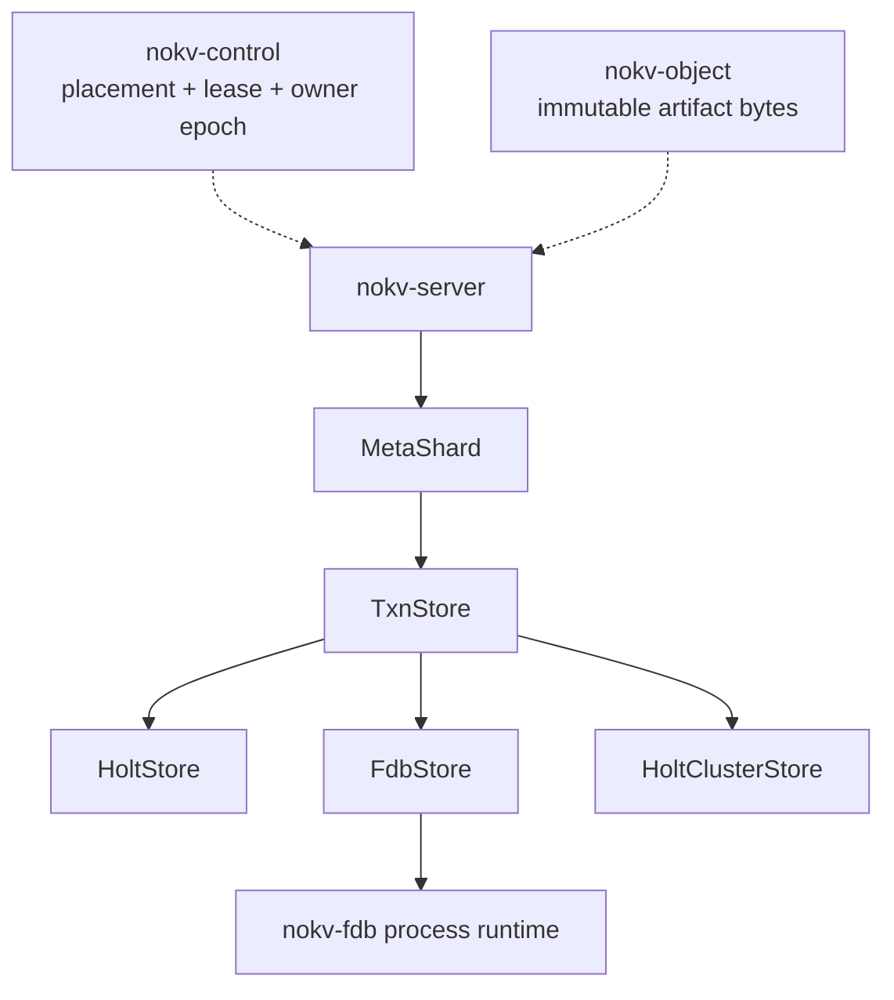
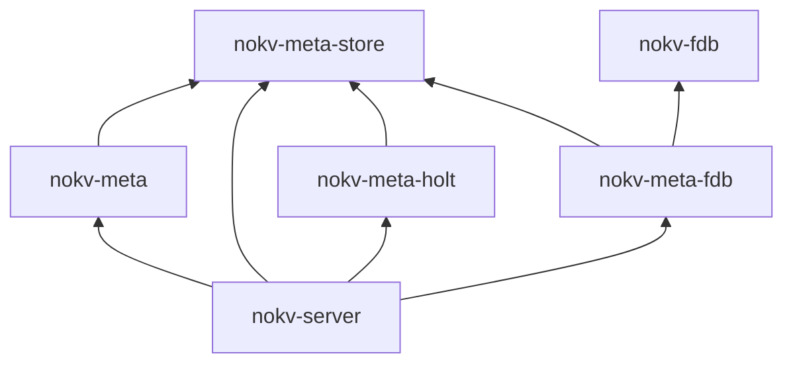

<!--
Copyright 2024-2026 The NoKV Authors.
SPDX-License-Identifier: Apache-2.0
-->

# Metadata Store Interface

Implemented: the storage-neutral interface, local Holt adapter, `MetaShard`
cutover, a process-global FoundationDB runtime boundary, and a non-default
FoundationDB characterization adapter. The serving local profile still uses
Holt through `TxnStore`; FoundationDB is **NOT QUALIFIED** and is not wired
into `nokv-server`. Pending: FoundationDB control/session admission, discovery,
serving composition and qualification, replicated Holt, and owner-safe
response delivery.

The [code contract](./code_contract.md), [architecture](../architecture.md),
and [metadata schema](../metadata-schema.md) remain normative.

## Decision

NoKV separates workspace metadata semantics from the ordered transaction store
that persists metadata records.

`nokv-meta` owns one `MetaShard` domain object for each `LogicalShardId`.
`MetaShard` executes commands, maintains history, enforces fences, and manages
workspace lifecycle state. It persists records through an injected
`TxnStore`.

`TxnStore` exposes consistent reads and conditional atomic writes over
ordered byte keys. Holt, FoundationDB, and a future Holt cluster can implement
this interface without duplicating workspace state machines.

NoKV uses statically linked adapter crates. It does not load dynamic plugins or
shared-library ABIs.

## Product Boundary

This decision changes internal metadata storage and shard bootstrap. It
preserves these Agent and Workbench boundaries:

- the 18-tool Workbench semantic contract
- primary native CLI Workbench commands and secondary Python SDK behavior
- the path-native `PathCurrent` namespace
- immutable artifact storage
- root placement in `nokv-control`

The `serve` command now attaches every Active root on its logical shard. The
protocol also limits artifact index fields to 60, which matches the metadata
planner. Neither change alters the 18-tool Workbench contract.

FUSE, POSIX, CSI, inode, and dentry behavior remain outside the product.

## Implemented Boundary

The cutover split the former combined metadata implementation into three
responsibilities:

- `nokv-meta` validates and executes workspace commands, owns the schema, and
  writes logical recovery records.
- `nokv-meta-store` defines ordered reads, checked atomic writes, store limits,
  acknowledgement boundaries, recovery authority, and physical errors.
- `nokv-meta-holt` maps the neutral requests to Holt trees, views, atomic
  batches, WAL acknowledgement, reopen, poison handling, and diagnostics.
- `nokv-fdb` owns the one process-global FoundationDB 7.3 API/network runtime,
  common database/transaction handles, connection options, physical store
  prefix/subspaces, and error classification. Its default feature set does not
  compile or link the FoundationDB client.
- `nokv-meta-fdb` maps the neutral requests to one explicit FoundationDB
  cluster file and binary metadata subspace through `nokv-fdb`. Its live tests
  are feature gated, and its synchronous `TxnStore` bridge remains
  characterization-only.

`bootstrap_shard` opens one `MetaShard` for a logical-shard owner and attaches
all Active roots found at startup. The server constructs the Holt adapter and
injects it as `Arc<dyn TxnStore>`. `nokv-meta` has no production Holt import.
Its dev-only workspace tests compose the Holt adapter through test support.

Logical read counters remain in `nokv-meta`. Holt cursor and database
diagnostics, session ownership, and physical counter mapping live in
`nokv-meta-holt`. Diagnostic callers retain typed handles to both layers. The
storage-neutral `TxnStore` interface does not expose adapter statistics.

## Runtime Shape



One process can own several logical shards. One logical-shard owner can attach
several roots. All attached roots share the same `Arc<MetaShard>`.

## Names

Implemented and reserved names are:

| Responsibility | Name | Status |
| --- | --- | --- |
| One logical metadata shard | `MetaShard` | Implemented |
| Ordered transaction store interface | `TxnStore` | Implemented |
| Embedded Holt implementation | `HoltStore` | Implemented |
| FoundationDB implementation | `FdbStore` | Characterization only; `NOT QUALIFIED` |
| Process-global FoundationDB runtime | `FdbRuntime` | Implemented; feature gated and non-restartable |
| Replicated Holt implementation | `HoltClusterStore` | Reserved |
| Workspace metadata error | `MetaError` | Implemented |
| Physical store error | `StoreError` | Implemented |
| Store selection | `StoreConfig` | Reserved |
| Namespace open mode | `OpenMode` | Implemented for Holt |

`Meta` names NoKV workspace semantics. `Store` names a physical ordered
transaction store. Identity and fence types retain their full names, including
`LogicalShardId`, `OwnerEpoch`, and `ReadVersion`.

Core interfaces do not use `Plugin`, `Manager`, `Provider`, `Engine`,
`Common`, or `Utils`.

## Package Direction

The target packages and dependencies are:



`nokv-server` composes `nokv-meta` with one configured adapter.

The exact dependency rules are:

- `nokv-meta-store` does not depend on `nokv-meta`, Holt, FoundationDB, or the
  server
- `nokv-meta` production code depends on `nokv-meta-store`, not Holt. Dev-only
  workspace tests can compose a qualified adapter through test support
- `nokv-meta-holt` depends on `nokv-meta-store` and Holt
- `nokv-fdb` is the only package that imports the selected FoundationDB Rust
  binding
- `nokv-meta-fdb` depends on `nokv-meta-store` and `nokv-fdb`
- store adapters do not depend on `nokv-meta` or know workspace record types
- `nokv-server` is the only production composition root

The interface package owns storage-neutral keyspace identifiers, read and write
request types, store limits, profiles, and errors.

## Schema Ownership

`nokv-meta` owns the single `nokv_workspace` schema, including the family map,
key and value codecs, schema marker, and state machines. It sends keyspace
identifiers and encoded bytes through `TxnStore`.

An adapter maps each keyspace to a Holt tree, FoundationDB subspace, or
replicated state-machine namespace. It must not define another record layout,
schema version, migration path, or workspace codec. Every adapter must enforce
the same format marker and schema gate through `MetaShard`.

## Store Interface

The runtime interface uses owned requests. It does not expose a transaction
closure or a transaction session that survives one call.

```rust
pub trait TxnStore: Send + Sync {
    fn profile(&self) -> StoreProfile;

    fn read(&self, batch: ReadBatch) -> Result<ReadSnapshot, StoreError>;

    fn commit(&self, txn: WriteTxn) -> Result<Commit, StoreError>;

    fn ready(&self) -> Result<(), StoreError>;
}
```

The first interface is synchronous because the current metadata, executor, and
server call graph is synchronous.

The Holt cutover did not include a full-stack async refactor. Before
FoundationDB qualification, a separate breaking change will make `TxnStore`,
`MetaShard`, and the server path async. It will replace the synchronous
interface instead of keeping two variants.

## Read Contract

`ReadBatch` contains point reads and bounded ordered prefix reads.
`ReadSnapshot` returns one result for each request. Every batch is linearizable
and observes one consistent store snapshot.

All reads in one batch must observe one consistent store snapshot. A scan
must support:

- one keyspace and one byte prefix
- an empty prefix to select the full keyspace
- an exclusive `after` cursor that is a canonical output key
- positive row and byte limits
- optional delimiter grouping
- lexicographic byte ordering
- early termination when either page limit is full

Each returned record or common prefix counts against the limit. The store must
not materialize the complete prefix before it applies the cursor and limit.
`ScanPage::more` states whether the store stopped before it reached the end of
the prefix. The final item on any page that sets `more` supplies the next
`after` cursor. Callers do not infer end of scan from a short page.

The scan byte limit counts each returned key and value. A common prefix counts
only its returned key bytes. The requested limit must allow one maximum-size
row so every valid row can make progress.

`MetaShard` may issue several bounded batches to reconstruct a historical view.
It must not ask an adapter for an unbounded historical scan.

Separate read calls do not share a physical snapshot. Each historical page
must read the domain commit clock in the same batch as its rows.

If the clock differs from the first page, `MetaShard` discards every collected
page and retries after 1, 2, and 4 milliseconds. The fourth failed attempt
returns a retryable read-version conflict. The applicable snapshot or history
hold must prevent GC from removing the requested version during that work.

NoKV `ReadVersion` remains a domain version. A store must not expose Holt
record versions, FoundationDB versions, or consensus log indexes as a NoKV
read version.

## Write Contract

`WriteTxn` contains checks and mutations:

```rust
pub struct WriteTxn {
    pub checks: Vec<Check>,
    pub mutations: Vec<Mutation>,
}

pub enum Check {
    Value {
        key: Key,
        expected: Vec<u8>,
    },
    Absent {
        key: Key,
    },
    EmptyPrefix {
        keyspace: Keyspace,
        prefix: Vec<u8>,
    },
}

pub enum Mutation {
    Put {
        key: Key,
        value: Vec<u8>,
    },
    Delete {
        key: Key,
    },
}

pub enum Commit {
    Applied,
    Conflict,
}
```

The store evaluates all checks and mutations in one serializable transaction.
`Applied` means every mutation reached the configured acknowledgement boundary
and is visible to later reads on the same store instance. `Conflict` means at
least one check did not hold and no mutation applied. The interface does not
identify one failed check because some stores cannot report it after an atomic
conflict.

Any successor that the profile permits to serve must first observe every
`Applied` commit under the same authority. `Local` permits an owner restart
only after the exact exclusive namespace is explicitly reopened and its WAL,
schema, recovery chain, and owner fence validate; it never permits a different
local authority to substitute for it. Shared and replicated profiles must
complete their open or catch-up boundary before route admission.

`MetaShard` translates one validated `MetadataCommand` into a `WriteTxn`.
Command deduplication, history, events, root fences, and deterministic results
remain ordinary checked metadata records in that transaction.

A successful `ReadBatch` is not an implicit write guard. When command planning
depends on an earlier non-empty scan, `MetaShard` must also check the applicable
domain commit-clock record. The first cutover preserves the current shard-wide
clock.

A later root-scoped clock can reduce unrelated conflicts. Removing that clock
requires a separate range-conflict contract before the change lands.

The Holt adapter translates exact byte checks to internal `RecordVersion`
assertions and `EmptyPrefix` to `assert_prefix_empty`. The FoundationDB
characterization adapter repeats the checks with non-snapshot reads in one
transaction so FoundationDB registers the required conflict ranges. These
mechanisms remain adapter details.

## Receipt Boundary

`TxnStore` does not define a second provider receipt format. Every successful
workspace command writes its `CommandDedupe` result, domain commit clock,
history, and events in the same `WriteTxn` as the authoritative mutation.
`RecoveryMode::LocalJournal` also writes the typed local receipt and
`RecoveryOutbox` material in that transaction. `RecoveryMode::StoreAuthority`
writes neither local artifact; the checked dedupe row in the shared or
replicated transaction store is the replay and reconciliation receipt.
`Commit::Applied` states only that the physical store reached its advertised
acknowledgement boundary.

An adapter can keep a physical transaction or log identifier for diagnostics
and recovery, but it cannot expose that identifier as a NoKV receipt or
`ReadVersion`. Before a shard can serve, the runtime must bind the domain
receipt namespace to the admitted physical authority and owner epoch. The
current local profile does this narrowly through an explicit `Existing` path,
Holt's lifetime exclusive directory lock, the durable shard identity and owner
fence, and full recovery-chain validation. A provider-neutral persistent store
identity and configuration digest remain pending; without them, another
directory, copy/rollback, or cross-host failover is not qualified.

## Error Contract

`StoreError` must distinguish these cases:

- invalid request
- configured limit exceeded
- unavailable before a commit could apply
- commit outcome unknown, with one recovery state
- corrupt physical state

`Conflict` is a commit result and not a store error. An adapter must not map an
unknown outcome to `Conflict` or `Unavailable`.

Unknown outcomes use these states:

| State | Store guarantee | NoKV action |
| --- | --- | --- |
| `Settled` | The physical call cannot change store state after returning. | Read `CommandDedupe` from the same linearizable store. Return the replay when present. Replan with the same request id and command digest when absent. |
| `MayCommit` | The original call can still commit after returning. | Replan only as a new domain transaction guarded by the same dedupe absence and commit clock. Never retry the raw `WriteTxn`. |
| `Poisoned` | The live view may be ahead of the acknowledgement boundary. The adapter poisoned the instance before returning. | Remove the shard routes, open and recover a new instance, and then reconcile `CommandDedupe`. |

The current Holt-only server deliberately takes the conservative subset of
this contract: every `OutcomeUnknown` fail-closes the process owner scope,
removes the affected shard routes, and permits no follow-up physical work.
State-specific `Settled` and `MayCommit` reconciliation remains part of the
provider admission/recovery work. This avoids a raw transaction retry without
claiming that third-party-provider recovery is already implemented.

A poisoned adapter must prevent every overlapping or later `read` and `commit`
from returning success after the poison transition. It must serialize operation
completion with that transition or recheck its state before publishing a
result.

`ready` remains unavailable until the caller opens a new instance.
Route removal cannot replace these checks because it can race an in-flight
request. Reading dedupe from the uncertain instance is not durability evidence.

The FoundationDB characterization adapter maps `commit_unknown_result` and
every other maybe-committed error to `MayCommit`; it never retries the raw
transaction. The Holt adapter maps `DefinitelyNotApplied` through
normal physical error classification. When that classification is
`Unavailable`, the server exposes a retryable request-local failure without
fencing the shard; a classified corruption remains non-retryable. It poisons
`OutcomeUnknown` and unclassified atomic errors until reopen and WAL replay
establish the durable boundary.

`MetaError` owns schema, command, history, placement, fence, and lifecycle
errors. It can contain `MetaError::Store(StoreError)`. Upper packages must not
match Holt or FoundationDB error types.

## Limits

`StoreProfile` reports the store-advertised hard logical request limits, the
preferred transaction-planning target, the acknowledgement boundary, the
location of recovery authority, and whether domain commands require a local
recovery journal. A planner target is nonzero and no greater than the hard
`max_transaction_bytes` limit. Adapters always enforce the hard limit; domain
batchers use the lower target when they can split work without changing
visibility or atomicity.

The Holt serving envelope remains sized around characterized
high-amplification metadata states. System format 11 also gives splittable
workspace operations a 900,000-byte transaction-shape gate. The FDB
characterization profile advertises that planning target while retaining its
2,900,000-byte logical hard limit and conservative physical affected-data
guard. Passing the logical shape gate is necessary but does not by itself
qualify the adapter for serving.

The serving budget covers:

- point reads and range endpoints
- bounded read result bytes
- point and range checks
- mutation count
- key bytes
- written value bytes
- total affected transaction bytes
- result rows and bytes

`max_read_bytes` is a conservative logical affected-byte budget. An adapter
must reserve room for keyspace or subspace prefixes, range endpoints, conflict
ranges, and other physical encoding overhead when it advertises that limit.
The serving budget does not count values returned by point reads as affected
transaction bytes, but `max_result_bytes` still bounds those values.

An `EmptyPrefix` check reserves the prefix start, its exclusive end, and one
maximum-size key. This covers the range read needed to prove that the prefix has
no row. Adapter-specific encoding overhead still comes from the profile reserve.

`MetaShard` validates every derived read and write request against the profile
before physical I/O. The local serving profile sets a 16,000,000-byte logical
write budget, an 8,205-byte encoded-key limit, a 65,535-byte value limit, and
bounded read pages. After maximum mutation overhead, the write budget stays
within Holt's 16 MiB WAL record envelope. File-backed format-11 tests preserve
create/reopen/replace/remove for both a short path with a 61,143-byte typed
projection and a maximum-length path with 64 dependencies and a 57,243-byte
projection.

SecondaryIndexV2 stages compact derived rows before one authoritative final
command and uses a generation-fenced asynchronous cleanup cursor. Exact logical
transaction-byte pins are:

- short-path replace-to-empty: 125,601-byte stage and 318,292-byte final;
- short-path remove: 311,466 bytes;
- maximum-path, 64-dependency create: 283,025-byte stage and 573,060-byte final;
- maximum-path replace-to-empty: 142,209-byte stage and 433,036-byte final;
- maximum-path remove: 357,070 bytes;
- disjoint 60-field republish with a 61,323-byte before/after event:
  213,813-byte stage and 366,418-byte final;
- maximum-projection rename: 397,058-byte stage and 696,582-byte final.

Large restore copy/cleanup batches with a 61,203-byte projection and root-wide
stale-index cleanup pages shrink against the same 900,000-byte planning target.
The previous format-10
fully derived transactions of 9,859,124, 11,797,827, and 11,791,492 bytes are
historical redesign baselines, not current format-11 serving shapes. These are
metadata-engine characterizations, not live FoundationDB qualification.

The local-WAL server qualifies restart of the same exclusive namespace with an
empty shared recovery frontier. It does not qualify rolling upgrade onto
another store, copied-directory recovery, or checkpoint/log failover. The FDB
adapter remains `NOT QUALIFIED` until the live conformance, failure,
unknown-outcome, failover, and performance gates below are retained as
evidence; the old monolithic publication transaction is no longer the schema
blocker.

Required transaction and read semantics are not optional capabilities. A store
that cannot provide them fails during startup.

## Open And Schema Lifecycle

The target composition boundary selects a statically linked store with typed
configuration:

```rust
pub enum StoreConfig {
    Holt(HoltOptions),
    Fdb(FdbOptions),
    HoltCluster(HoltClusterOptions),
}

pub enum OpenMode {
    New,
    Existing,
    RecoverLog,
}
```

`New` requires an empty namespace. `Existing` requires the exact supported
physical layout, workspace schema marker, and logical-shard identity.
`RecoverLog` creates or resumes a local authority from the exact receipt-bound
shared-log frontier stored in Control; it never falls back to `New` or
`Existing` based on path existence.

The current CLI and server expose only the Holt local profile as an explicit
new or existing filesystem path. Provider-neutral `StoreConfig`, persistent
store identity, and configuration-digest admission remain pending. Startup
must not add a provider fallback while that work is incomplete.

The adapter owns connection setup, local paths, remote endpoints, and physical
keyspace mapping. `MetaShard` owns the `nokv_workspace` schema marker and system
record values.

Fresh initialization writes all domain system records in one transaction. A
Holt adapter requires an empty physical tree registry before it starts.

If tree creation fails, the caller must discard that namespace and retry at a
fresh location. The adapter does not complete a partial tree catalog.

Existing mode requires the exact configured catalog. It must reject any
unmarked namespace that contains domain records.

The target server configuration is tagged. It does not encode cluster
files, credentials, or namespace settings into a provider URI. A missing build
feature causes a startup error and never falls back to Holt.

## Shard Bootstrap

The first migration stage replaced root-scoped store bootstrap with two
operations:

```text
bootstrap_shard
attach_root
```

`bootstrap_shard` performs these steps:

1. Validate the open mode, root placements, control record, and shared recovery
   frontier.
2. Before any new acquisition, initialize or exclusively reopen the explicit
   local namespace. Holt replays its WAL; `MetaShard` validates the catalog,
   schema, logical-shard identity, system rows, and full recovery-outbox chain.
3. Compare the local owner fence with the durable control state. A normal
   successor requires the exact previous epoch. An interrupted `Recovering`
   attempt accepts only that recovery epoch or its immediate predecessor.
4. Atomically acquire the first/next epoch, or rebind an unfinished recovery
   attempt at the same epoch after proving its previous session key is absent.
   An exact live-session `Resume` still renews before reopening.
5. Advance the local owner fence idempotently before any route is installed,
   attach roots, renew once, and publish `Serving`.

`attach_root` then:

1. Loads the persisted `RootPlacement`.
2. Confirms that it belongs to the bootstrapped logical shard.
3. Installs or validates the root fence.
4. Installs the root route with an executor that shares the `MetaShard`.

The server publishes the logical shard as serving only after its initial root
routes are ready. It renews and releases the shard lease once per shard, not
once per root.

A physical initialization or reopen validation failure occurs before control
acquisition and consumes no epoch. A first-owner admission failure preserves
the prepared epoch-zero store and reports an `Existing` retry. If the control
outcome was unknown, that retry reconciles either result after the session
settles: it acquires epoch one if the transaction did not apply, or rebinds the
durable `Recovering` epoch one if it did. Bootstrap never infers directory
ownership from a path precheck or recursively deletes a prepared store; both
would be unsafe under a concurrent path change.

### Control Record Layout And Client Compatibility

The control plane stores one logical shard under two etcd keys with two
independent codec versions:

- `logical-shards/<id>` holds the **routing record**: owner, owner epoch,
  lease id, state, and endpoint. Its wire schema is frozen at version 1, the
  same value every released NoKV client (0.10.0 and earlier) decodes with a
  strict, exact-version reader. This key is the client compatibility contract:
  a client that understands version 1 must keep decoding it, so no field is
  ever added to it. Its recovery fields are always `null` and its
  `durable_lsn` is always `0`; a client cannot consume recovery receipts and
  therefore sees "no shared frontier", which is the only frontier a version-1
  reader can validate.
- `logical-shard-recovery/<id>` holds the **recovery state** only owners read:
  the published checkpoint and log references with their object receipts, the
  durable LSN they prove, and the pending recovery upload intent. It has its
  own codec version and may evolve without touching the routing schema. The
  key is absent whenever the record carries no recovery state; absence and
  emptiness are the same durable fact.

Every owner-fenced mutation writes both keys in one etcd transaction guarded
by the routing key's modification revision, and every read fetches both keys
in one transaction, so the pair is never observed torn. A legacy combined
value (versions 2 and 3, written at the routing key by owners built between
the recovery-outbox work and this split) is still decoded completely; it wins
over any recovery key beside it and the next owner mutation re-splits it.
Readers report a record version they do not implement as
`ControlError::UnsupportedRecordVersion` before parsing any field, so an
outdated client says "upgrade me" instead of failing on an unknown field.

The frozen 0.10.0 reader is vendored into the `nokv-control` codec tests and
must decode every routing value this crate writes; that test is the executable
form of the contract above. Bumping the routing version is a deliberate,
client-breaking release decision, never a side effect of adding owner state.

The control record and the lease-backed session key have separate lifetimes.
`Recovering` is a durable attempt token. A bootstrap rollback removes only its
session (`suspend_recovery`) and retains the record; an ungraceful process loss
gets the same result when etcd expires the session key. Control refuses to
increment past a `Recovering` record. The next bootstrap must rebind that exact
epoch, then tolerate only two local states: the predecessor when the crash was
before local fence installation, or the exact epoch when it was after. This
keeps retries idempotent and prevents the epoch-gap strand where control moves
to `E+2` while the local authority remains at `E`.

Lifecycle work remains root-scoped because each runner owns root-specific
cursors. Every attached root gets one supervised lifecycle runner. Runtime
root attachment stays private until the server can install and supervise that
runner with the route.

The CLI attaches every Active placement found for the shard at startup. A root
that becomes Active later requires an owner restart until runtime attachment is
implemented.

The current Holt-only bootstrap admits a first `New` owner, an epoch-zero
`Existing` retry, an exact live-session `Resume`, same-namespace `Existing`
restart after owner loss, and `RecoverLog` from a strict receipt-directed log
frontier. Existing and recovery paths prove the local durable chain against
Control both before and after owner acquisition. `RecoverLog` can resume a
verified local-ahead state left by pending replay or owner activation; a digest
divergence, stale lease, live prior session, malformed receipt, ambiguous
cleanup, or uninitialized replacement remains fail-closed. A Control
checkpoint still requires a published bounded Holt install API and is not
admitted by the default build. Bootstrap does not yet select provider
construction from a provider-neutral persistent configuration.

In the target runtime, open mode does not decide successor admission.
`StoreProfile::authority`, `StoreProfile::recovery`, and the server's
qualification policy decide whether a successor has a valid recovery path.
`AckBoundary` alone is not a failover policy.

An admitted successor must include every commit that returned `Applied` under
that authority. Adapter conformance and server failover tests must prove this
before the profile can qualify.

## Store Profiles

The initial profiles are:

| Store | Transaction target | `Authority` | `AckBoundary` | `RecoveryMode` | Successor status |
| --- | ---: | --- | --- | --- | --- |
| `HoltStore` | hard limit | `Local` | `LocalSync` | `LocalJournal` | Same exclusive namespace restart qualified; replacement/cross-host failover refused |
| `FdbStore` | 900,000 bytes | `Shared` | `SharedCommit` | `StoreAuthority` | Proposed, not qualified |
| `HoltClusterStore` | not defined | `Replicated` | `QuorumCommit` | `StoreAuthority` | Proposed, not implemented |

`RecoveryMode::LocalJournal` requires the command's local recovery receipt and
hash-chained `RecoveryOutbox` material in the same transaction. With
`RecoveryMode::StoreAuthority`, the shared or replicated store is the recovery
evidence and domain commands do not write that second local chain. The current
outbox is not the consensus log for `HoltClusterStore`.

`OwnerEpoch`, NoKV `ReadVersion`, and a replicated log term or index remain
separate values. A store implementation must not substitute one for another.

One `LogicalShardId` maps to one Holt replication group in the first clustered
design. A cluster store improves durability and availability. It does not split
one hot root across metadata partitions.

## Deferred Work

The Holt extraction preserves the current command clock, command gate, and
recovery outbox behavior. Later changes can remove shard-wide write
serialization without combining that work with the interface cutover.

FoundationDB production work must address:

- a root-scoped logical commit clock
- physical affected-byte sizing and representative transaction qualification
- retained format-11 publication, restore, rename, and stale-index transaction
  shape evidence on the real adapter
- asynchronous server execution
- unknown-outcome and conflict fault injection
- failover and benchmark qualification

The server runtime must also persist and validate the exact binding between a
logical shard, owner epoch, physical store identity, store profile, and
configuration digest. The current registry now closes the complete shard
route set and holds a response permit through socket delivery when lease loss
or adapter poison occurs. Durable provider admission and restart-time
metadata-transaction unknown-outcome reconciliation remain
[Issue #436](https://github.com/NoKV-Lab/NoKV/issues/436) requirements, not
`TxnStore` methods.

Splitting one hot root requires a permanent `MetadataPartitionId` and explicit
cross-partition semantics. Filename hashing is not an acceptable substitute.

## Validation

Every store implementation must run the shared interface tests for:

- consistent point and range reads
- linearizable reads and read-after-`Applied`
- ordered cursor and delimiter scans
- explicit scan completion and byte limits
- value, absence, and empty-prefix checks
- atomic multi-keyspace writes
- deterministic conflicts
- limit rejection
- empty initialization and exact reopen

The FoundationDB adapter uses the following evidence gates:

| Gate | Command or environment | Qualification |
| --- | --- | --- |
| Common runtime, prefix, option, and error tests | `cargo test -p nokv-fdb` | Required in the default workspace; does not load `libfdb_c` |
| Pure options, encoding, limit, and error tests | `cargo test -p nokv-meta-fdb` | Required in the default workspace; does not load `libfdb_c` |
| Binding API compile | `cargo check -p nokv-fdb --features fdb --all-targets && cargo check -p nokv-meta-fdb --features fdb --all-targets` | Required for the selected 7.3 API |
| Shared conformance, binary scans, conflict, reopen, and namespace isolation | `NOKV_TEST_FDB_CLUSTER_FILE=/absolute/path cargo test -p nokv-meta-fdb --features fdb --test fdb_conformance -- --ignored --nocapture` | Environment-gated; `NOT QUALIFIED` unless the run and output are retained |
| Unknown outcome, process/network loss, failover, and representative performance | Dedicated fault and benchmark environments | `NOT QUALIFIED` |

### Adapter Fault Tests

The shared runner does not inject commit faults.

Each adapter must test every unknown-outcome state that it can return, including
sticky poison and recovery when applicable. The unchanged workspace suite and
backend-specific tests cover Holt crash/reopen, FoundationDB process and network
failures, or Holt cluster leader and snapshot failures.

No FoundationDB or Holt cluster profile can claim production durability,
failover, or performance until the applicable workspace acceptance gates report
`PASS`. Source presence and unit tests do not change a `NOT QUALIFIED` result.

## Migration Status

Completed in the local Holt cutover:

1. Replace root-scoped bootstrap with shard bootstrap and root attachment.
2. Split domain statistics from Holt diagnostics and make historical reads use
   bounded store pages.
3. Add the `nokv-meta-store` contract, validators, and conformance suite.
4. Add the serving `nokv-meta-holt` adapter with strict initialize/reopen,
   poison handling, WAL recovery tests, and adapter diagnostics.
5. Cut over `MetaShard`, remove the Holt dependency and old constructors from
   `nokv-meta`, and inject the adapter in `nokv-server`.
6. Enforce the serving logical limits before physical I/O.
7. Fence shard admission and response delivery immediately on lease loss or a
   poisoned store outcome.
8. Reopen the same exclusive local authority as a successor and retain/rebind
   interrupted control-plane recovery epochs without creating an epoch gap.

Remaining work:

1. Add the FDB catalog, ownership session, discovery, and persistent serving
   admission around the implemented process runtime.
2. Add exact session checks and metadata-transaction unknown-outcome recovery
   orchestration without raw transaction retries.
3. Qualify the non-default `nokv-meta-fdb` adapter only after its
   large-transaction, workspace, failure, failover, and benchmark gates pass.
4. Add `HoltClusterStore` only after its replicated transaction format exists.

The cutover retains no forwarding constructors, aliases, fallback stores, or
parallel metadata implementations.
