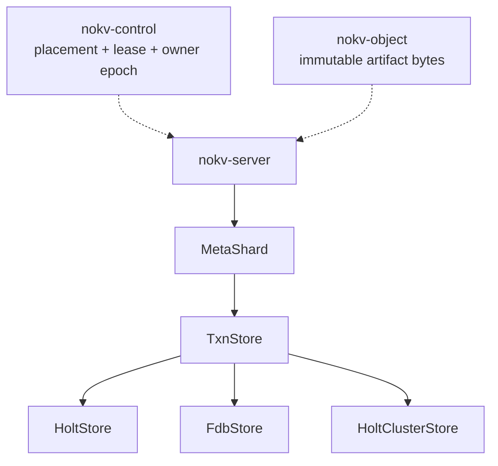
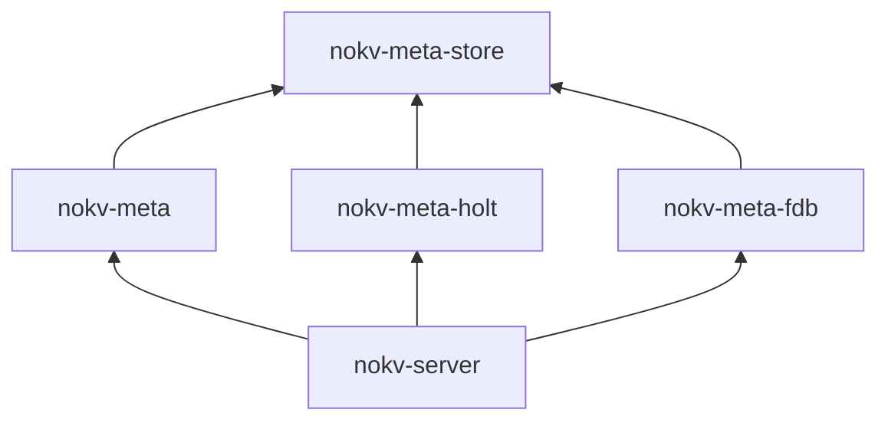

<!--
Copyright 2024-2026 The NoKV Authors.
SPDX-License-Identifier: Apache-2.0
-->

# Metadata Store Interface

Status: proposed architecture decision. The production implementation still
binds `nokv-meta` directly to Holt.

The [code contract](./code_contract.md), [architecture](../architecture.md),
and [metadata schema](../metadata-schema.md) remain normative until the
interface cutover updates them.

Baseline: NoKV `81832382`.

## Decision

NoKV will separate workspace metadata semantics from the ordered transaction
store that persists metadata records.

`nokv-meta` will own one `MetaShard` domain object for each `LogicalShardId`.
`MetaShard` will execute commands, maintain history, enforce fences, and manage
workspace lifecycle state. It will persist records through an injected
`TxnStore`.

`TxnStore` will expose consistent reads and conditional atomic writes over
ordered byte keys. Holt, FoundationDB, and a future Holt cluster can implement
this interface without duplicating workspace state machines.

The implementation will use statically linked adapter crates. It will not load
dynamic plugins or shared-library ABIs.

## Product Boundary

This decision changes internal metadata storage and server assembly. It does
not change:

- the 18-tool Workbench contract
- Rust or Python SDK semantics
- CLI or MCP behavior
- protocol request and response semantics
- the path-native `PathCurrent` namespace
- immutable artifact storage
- root placement in `nokv-control`

FUSE, POSIX, CSI, inode, and dentry behavior remain outside the product.

## Current Coupling

The current `AgentMetadataStore` combines four responsibilities in
[`engine.rs`](../../crates/nokv-meta/src/workspace/engine.rs):

- workspace command validation and execution
- Holt database, tree, view, and `RecordVersion` access
- schema initialization and local path handling
- logical recovery records and Holt read statistics

The current bootstrap opens that logical-shard store from the root-scoped
`bootstrap_root_owner` function in
[`bootstrap.rs`](../../crates/nokv-server/src/bootstrap.rs). This works for the
current one-root CLI process. It would open the same logical shard more than
once when one process serves several roots from that shard.

The current error boundary also names Holt in a domain error. The statistics
boundary combines logical read counts with Holt-specific counters. Both
boundaries must be split before another store can implement the same contract.

## Runtime Shape



One process can own several logical shards. One logical-shard owner can attach
several roots. All attached roots share the same `Arc<MetaShard>`.

## Names

The public names inside the new packages are:

| Responsibility | Name |
| --- | --- |
| One logical metadata shard | `MetaShard` |
| Ordered transaction store interface | `TxnStore` |
| Embedded Holt implementation | `HoltStore` |
| FoundationDB implementation | `FdbStore` |
| Replicated Holt implementation | `HoltClusterStore` |
| Workspace metadata error | `MetaError` |
| Physical store error | `StoreError` |
| Store selection | `StoreConfig` |
| Namespace open mode | `OpenMode` |

`Meta` names NoKV workspace semantics. `Store` names a physical ordered
transaction store. Identity and fence types retain their full names, including
`LogicalShardId`, `OwnerEpoch`, and `ReadVersion`.

Core interfaces will not use `Plugin`, `Manager`, `Provider`, `Engine`,
`Common`, or `Utils`.

## Package Direction

The target packages and dependencies are:



`nokv-server` composes `nokv-meta` with one configured adapter.

The exact dependency rules are:

- `nokv-meta-store` does not depend on `nokv-meta`, Holt, FoundationDB, or the
  server
- `nokv-meta` depends on `nokv-meta-store` and no longer depends on Holt
- `nokv-meta-holt` depends on `nokv-meta-store` and Holt
- `nokv-meta-fdb` depends on `nokv-meta-store` and the selected FoundationDB
  Rust binding
- store adapters do not depend on `nokv-meta` or know workspace record types
- `nokv-server` is the only production composition root

The interface package owns storage-neutral keyspace identifiers, read and write
request types, store limits, profiles, and errors.

## Schema Ownership

`nokv-meta` owns the single `nokv_workspace` schema, including the family map,
key and value codecs, schema marker, and state machines. It sends keyspace
identifiers and encoded bytes through `TxnStore`.

An adapter maps each keyspace to a Holt tree, FoundationDB subspace, or
replicated state-machine namespace. It must not define another record layout,
schema version, migration path, or workspace codec. Every adapter must enforce
the same format marker and schema gate through `MetaShard`.

## Store Interface

The runtime interface uses owned requests. It does not expose a transaction
closure or a transaction session that survives one call.

```rust
pub trait TxnStore: Send + Sync {
    fn profile(&self) -> StoreProfile;

    fn read(&self, batch: ReadBatch) -> Result<ReadSnapshot, StoreError>;

    fn commit(&self, txn: WriteTxn) -> Result<Commit, StoreError>;

    fn ready(&self) -> Result<(), StoreError>;
}
```

The first interface is synchronous because the current metadata, executor, and
server call graph is synchronous.

The Holt cutover must not include a second full-stack async refactor. Before
FoundationDB qualification, a separate breaking change will make `TxnStore`,
`MetaShard`, and the server path async. It will replace the synchronous
interface instead of keeping two variants.

## Read Contract

`ReadBatch` contains point reads and bounded ordered range reads.
`ReadSnapshot` returns one result for each request.

All reads in one batch must observe one consistent store snapshot. A range read
must support:

- one keyspace and one byte prefix or exclusive byte range
- an exclusive `after` cursor
- a positive result limit
- optional delimiter grouping
- lexicographic byte ordering
- early termination when the page is full

Each returned record or common prefix counts against the limit. The store must
not materialize the complete prefix before it applies the cursor and limit.
`MetaShard` may issue several bounded batches to reconstruct a historical view.
It must not ask an adapter for an unbounded historical scan.

NoKV `ReadVersion` remains a domain version. A store must not expose Holt
record versions, FoundationDB versions, or consensus log indexes as a NoKV
read version.

## Write Contract

`WriteTxn` contains checks and mutations:

```rust
pub struct WriteTxn {
    pub checks: Vec<Check>,
    pub mutations: Vec<Mutation>,
}

pub enum Check {
    Value {
        key: Key,
        expected: Vec<u8>,
    },
    Absent {
        key: Key,
    },
    EmptyPrefix {
        keyspace: Keyspace,
        prefix: Vec<u8>,
    },
}

pub enum Mutation {
    Put {
        key: Key,
        value: Vec<u8>,
    },
    Delete {
        key: Key,
    },
}

pub enum Commit {
    Applied,
    Conflict,
}
```

The store evaluates all checks and mutations in one serializable transaction.
`Applied` means the configured acknowledgement boundary accepted every
mutation. `Conflict` means at least one check did not hold and no mutation
applied. The interface does not identify one failed check because some stores
cannot report it after an atomic conflict.

`MetaShard` will translate one validated `MetadataCommand` into a `WriteTxn`.
Command deduplication, history, events, root fences, and deterministic results
remain ordinary checked metadata records in that transaction.

A successful `ReadBatch` is not an implicit write guard. When command planning
depends on an earlier non-empty scan, `MetaShard` must also check the applicable
domain commit-clock record. The first cutover preserves the current shard-wide
clock.

A later root-scoped clock can reduce unrelated conflicts. Removing that clock
requires a separate range-conflict contract before the change lands.

Holt can translate exact byte checks to internal `RecordVersion` assertions and
`EmptyPrefix` to `assert_prefix_empty`. FoundationDB can repeat the checks in
one transaction and register the required conflict ranges. These mechanisms
remain adapter details.

## Error Contract

`StoreError` must distinguish these cases:

- invalid request
- configured limit exceeded
- unavailable before a commit could apply
- commit outcome unknown
- corrupt physical state

`Conflict` is a commit result and not a store error. An adapter must not map an
unknown outcome to `Conflict` or `Unavailable`.

If a commit outcome is unknown, NoKV reconciles the original `RequestId` and
command digest through `CommandDedupe`.

NoKV returns an exact replay when the durable record exists. It replans the
domain command when an authoritative read shows that the record is absent. It
does not retry the old physical `WriteTxn` without reconciliation.

An adapter must mark itself unready when its live view can advance before the
configured acknowledgement boundary. The server then removes the shard routes
and reopens or replays the store to that boundary before dedupe reconciliation.
Reading dedupe from the same uncertain live view is not durability evidence.

`MetaError` owns schema, command, history, placement, fence, and lifecycle
errors. It can contain `MetaError::Store(StoreError)`. Upper packages must not
match Holt or FoundationDB error types.

## Limits

`StoreProfile` reports physical limits and the acknowledgement boundary.
NoKV defines one portable transaction budget below every qualified store
limit.

The portable budget covers:

- point and range checks
- mutation count
- key bytes
- written value bytes
- total affected transaction bytes
- result rows and bytes

The current per-list count and per-value checks do not bound total transaction
bytes. The FoundationDB adapter cannot qualify until NoKV enforces the portable
total budget before dispatch.

Required transaction and read semantics are not optional capabilities. A store
that cannot provide them fails during startup.

## Open And Schema Lifecycle

The server selects a statically linked store with typed configuration:

```rust
pub enum StoreConfig {
    Holt(HoltOptions),
    Fdb(FdbOptions),
    HoltCluster(HoltClusterOptions),
}

pub enum OpenMode {
    New,
    Existing,
}
```

`New` requires an empty namespace. `Existing` requires the exact supported
physical layout, workspace schema marker, and logical-shard identity.

The adapter owns connection setup, local paths, remote endpoints, and physical
keyspace mapping. `MetaShard` owns the `nokv_workspace` schema marker and system
record values.

Fresh initialization writes all domain system records in one transaction. A
Holt adapter can resume an exact empty physical layout after a crash before
that transaction. It must reject any unmarked namespace that contains domain
records.

The server uses a tagged configuration structure. It does not encode cluster
files, credentials, or namespace settings into a provider URI. A missing build
feature causes a startup error and never falls back to Holt.

## Shard Bootstrap

The server will replace root-scoped store bootstrap with two operations:

```text
bootstrap_shard
attach_root
```

`bootstrap_shard` performs these steps:

1. Validate `StoreConfig`, `OpenMode`, and the store failover profile.
2. Get or resume one `LogicalShardLease`.
3. Open one physical store and one `MetaShard`.
4. Validate the schema and logical-shard identity.
5. Advance the shard owner epoch at the metadata commit boundary.

`attach_root` then:

1. Loads the persisted `RootPlacement`.
2. Confirms that it belongs to the bootstrapped logical shard.
3. Installs or validates the root fence.
4. Installs the root route with an executor that shares the `MetaShard`.

The server publishes the logical shard as serving only after its initial root
routes are ready. It renews and releases the shard lease once per shard, not
once per root.

Lifecycle work remains root-scoped because each runner owns root-specific
cursors. Every attached root gets one supervised lifecycle runner. Runtime
root attachment stays private until the server can install and supervise that
runner with the route.

The CLI attaches every Active placement found for the shard at startup. A root
that becomes Active later requires an owner restart until runtime attachment is
implemented.

Open mode does not decide successor admission. The store profile decides which
failover paths have a valid authority and recovery boundary.

## Store Profiles

The initial profiles are:

| Store | Authority | Acknowledgement | Successor status |
| --- | --- | --- | --- |
| `HoltStore` | Process-local directory | Synchronous local WAL | Refused until checkpoint and log recovery qualify |
| `FdbStore` | Shared transactional database | Successful FoundationDB commit | Proposed, not qualified |
| `HoltClusterStore` | Replicated state machine | Quorum commit and local apply | Proposed, not implemented |

The current hash-chained `RecoveryOutbox` is local recovery and export material.
It is not the consensus log for `HoltClusterStore`.

`OwnerEpoch`, NoKV `ReadVersion`, and a replicated log term or index remain
separate values. A store implementation must not substitute one for another.

One `LogicalShardId` maps to one Holt replication group in the first clustered
design. A cluster store improves durability and availability. It does not split
one hot root across metadata partitions.

## Deferred Work

The first Holt extraction preserves the current command clock, command gate,
and recovery outbox behavior. Later changes can remove shard-wide write
serialization without combining that work with the interface cutover.

FoundationDB production work must address:

- a root-scoped logical commit clock
- removal of local recovery-chain writes from its hot commit path
- portable transaction byte limits
- asynchronous server execution
- unknown-outcome and conflict fault injection
- failover and benchmark qualification

Splitting one hot root requires a permanent `MetadataPartitionId` and explicit
cross-partition semantics. Filename hashing is not an acceptable substitute.

## Validation

Every store implementation must run the same interface tests for:

- consistent point and range reads
- ordered cursor and delimiter scans
- value, absence, and empty-prefix checks
- atomic multi-keyspace writes
- deterministic conflicts
- unknown commit outcomes
- limit rejection
- empty initialization and exact reopen

The workspace suite must run unchanged over each store. Backend-specific tests
then cover Holt crash/reopen, FoundationDB process and network failures, or Holt
cluster leader and snapshot failures.

No FoundationDB or Holt cluster profile can claim production durability,
failover, or performance until the applicable workspace acceptance gates report
`PASS`. Source presence and unit tests do not change a `NOT QUALIFIED` result.

## Migration

Implementation proceeds in separate changes:

1. Add this proposed decision without changing the normative code contract.
2. Replace root-scoped bootstrap with shard bootstrap and root attachment.
3. Split domain statistics from Holt statistics and make historical reads use
   bounded store pages.
4. Add `nokv-meta-store` and `nokv-meta-holt` in one Holt cutover.
5. Remove the direct `nokv-meta -> holt` dependency and old constructors.
6. Add portable limits and remove FoundationDB hot-path blockers.
7. Replace the synchronous store and server path with one async path.
8. Add the non-default `nokv-meta-fdb` adapter and its conformance suite.
9. Add `HoltClusterStore` only after its replicated transaction format exists.

The Holt cutover updates the normative code contract and review checklist in
the same change. It will not retain forwarding constructors, aliases, fallback
stores, or parallel metadata implementations.
