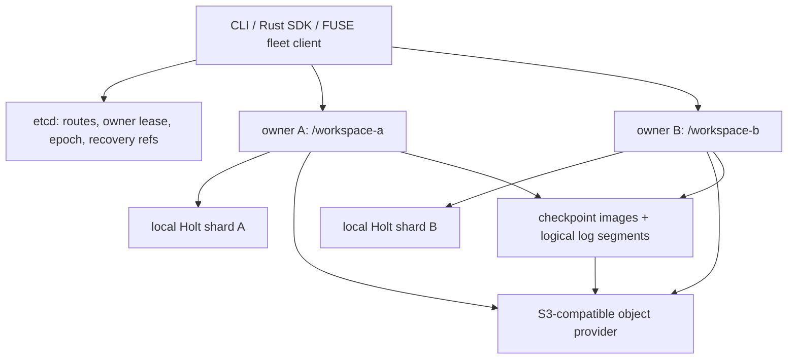

<!--
Copyright 2024-2026 The NoKV Authors.
SPDX-License-Identifier: Apache-2.0
-->

# Metadata Sharding And Recovery

> **Status: Experimental.** Single-node NoKV with one embedded Holt metadata
> store is the default and most mature deployment. The multi-shard fleet,
> etcd-backed ownership, checkpoint restore, and logical shared-log recovery
> paths are implemented and covered by local smoke tests, but they are not yet a
> production high-availability claim.

NoKV scales metadata by assigning namespace subtrees to independent shard
owners. Each shard keeps a lightweight local Holt store; NoKV, not Holt, owns
path routing, shard identity, ownership fencing, recovery publication, and the
filesystem-level semantics that span those components.

This design targets high-throughput metadata and small-file workloads by
letting independent path prefixes execute on different owners. It does not make
one Holt database distributed, replicate every metadata operation through
consensus, or make cross-shard operations atomic.

## Current Deployment Shapes

### Single node

```text
client / FUSE / SDK
        |
   nokv-server
        |
  embedded Holt  ---- object provider
```

This mode has one metadata authority and no external metadata failover. A
successful metadata RPC means the local Holt commit completed. Physical object
durability is determined by the configured object provider.

### Experimental fleet



The CLI, Rust SDK, and FUSE path can construct a fleet client from the control
plane. The current Python binding accepts one `metadata_addr`; it does not yet
construct a fleet client from etcd endpoints.

## Routing And Shard Identity

- Path requests use longest-prefix routing. The default shard owns `/`; a
  registered subtree shard such as `/workspace-a` owns that prefix and its
  descendants.
- Every shard has a stable `shard_index`. The index is encoded in the high bits
  of newly allocated inode IDs, so inode-addressed requests can route without a
  path lookup.
- A cross-shard graft dentry connects the parent namespace to a subtree root.
  The control record is the durable registration point, and startup
  reconciliation recreates a missing parent-side graft when possible.
- Each shard has one active owner at a time. Different shards can run on
  different processes or machines for horizontal throughput.

The current topology is static after registration. Moving an already-populated
subtree between shard identities is not an online reshard operation.

## Atomicity Boundary

`MetadataCommand` is the metadata transaction boundary. Holt applies one
command, including its predicates, history records, dedupe row, watch
projection, and namespace mutations, in one local atomic batch.

That guarantee is **shard-local**:

- an independent batch is accepted only when every sub-request resolves to the
  same shard;
- cross-shard `rename`, `hardlink`, and clone-style namespace operations return
  `EXDEV`/`CrossShard`;
- there is no distributed two-phase commit or cross-shard serializable
  transaction;
- a stable historical view inside one shard requires a snapshot pin; there is
  no fleet-wide atomic snapshot protocol.

Artifact publication follows an object-first rule within the selected shard:

```text
1. upload immutable object blocks
2. build one metadata command for the new generation
3. atomically publish inode, dentry projection, body summary, and manifests
4. expose the new namespace state
```

This prevents metadata from pointing at an object upload that never completed.
An upload that completed before a failed metadata publish may remain as an
unreachable object until explicit cleanup or a provider-side scrub identifies
it.

## Control Plane

The optional control plane stores small coordination records, not filesystem
metadata:

```text
ShardRecord
  shard_id
  prefix + shard_index + subtree_root_inode
  owner + endpoint
  epoch + lease_id + state
  checkpoint ref + log ref + durable_lsn
```

The etcd backend uses a durable shard record plus an ephemeral owner-session
key. Acquisition and failover use etcd transactions; the owner lease and shard
epoch fence stale owners at the NoKV metadata commit boundary. This is a
single-active-owner protocol, not multi-writer replication.

The correctness claim depends on the control backend, owner lease checks, and
recovery publication remaining available and correctly configured. Local
process-stall tests exercise epoch fencing; multi-machine network-partition
qualification is still pending.

## Recovery State

A controlled shard publishes two kinds of recovery data to the object provider:

```text
checkpoint image
  complete Holt shard image at checkpoint_lsn

logical shared log
  ordered MetadataCommand segments after checkpoint_lsn
```

The shared log contains NoKV logical commands rather than Holt's private WAL.
Segment decoding validates identity, command payloads, digests, and LSN
continuity before replay.

For a control-owned shard, the implemented success path is:

```text
1. verify the owner lease and epoch
2. apply the metadata command atomically in local Holt
3. archive the resulting logical-log segment
4. publish the exact recovery pointer through the control plane
5. return a successful RPC response
```

The ordering matters: Holt applies before the shared-log archive and control
pointer publication. If step 3 or 4 fails, the RPC can report a durability error
with `committed=true`. The caller must not blindly create a new logical request;
it should preserve the request identity and resolve the ambiguous result. While
the local tail and published recovery pointer differ, controlled reads are
failed closed or repair the pointer under the publication gate.

This provides a recoverable acknowledged-write path when the object provider
and control plane meet their own durability guarantees. It is not equivalent to
a quorum-replicated metadata log, and the project does not currently publish a
general production RPO/RTO guarantee.

## Failover Sequence

```text
1. the previous owner session expires or is released
2. a replacement compares the prior state and acquires a higher epoch
3. it installs the latest checkpoint image
4. it validates and replays the published logical-log tail
5. it reconciles local grafts and recovery pointers
6. it marks the shard serving
7. fleet clients refresh the shard map and route to the new endpoint
```

The old owner is rejected when it observes an expired lease or stale epoch. The
implemented tests cover in-process recovery, an env-gated etcd session-expiry
path, and local multi-process RustFS + etcd smoke tests. See the
[experimental fleet runbook](./multishard-fleet-runbook.md) for the runnable
shape and its limitations.

## Throughput Scope

Sharding creates parallel metadata lanes: unrelated prefixes can commit on
different owners, each using a local Holt fast path. Object bytes continue to
flow directly through the configured object provider, and batch/range reads can
amortize metadata and object-request overhead.

Current benchmarks do not qualify an enterprise small-file throughput target or
a multi-machine fleet. Capacity planning must therefore measure at least:

- operations per second and tail latency per shard;
- scaling as prefixes and owners are added;
- object-provider PUT/GET/range limits;
- sync recovery-publication overhead;
- hot-key and hot-directory skew;
- failover time and behavior under real network partitions.

## Explicit Non-Claims

The current implementation does not provide:

- consensus-replicated or multi-writer Holt metadata;
- atomic transactions, rename, or complete query aggregation across shards;
- online resharding of populated subtrees;
- Python fleet routing;
- built-in tenant authentication or authorization for the fleet;
- completed multi-machine chaos, rolling-upgrade, or enterprise-throughput
  qualification.

These boundaries are intentional documentation of the current `main` branch,
not a statement that the experimental fleet is ready for an unattended
production deployment.
