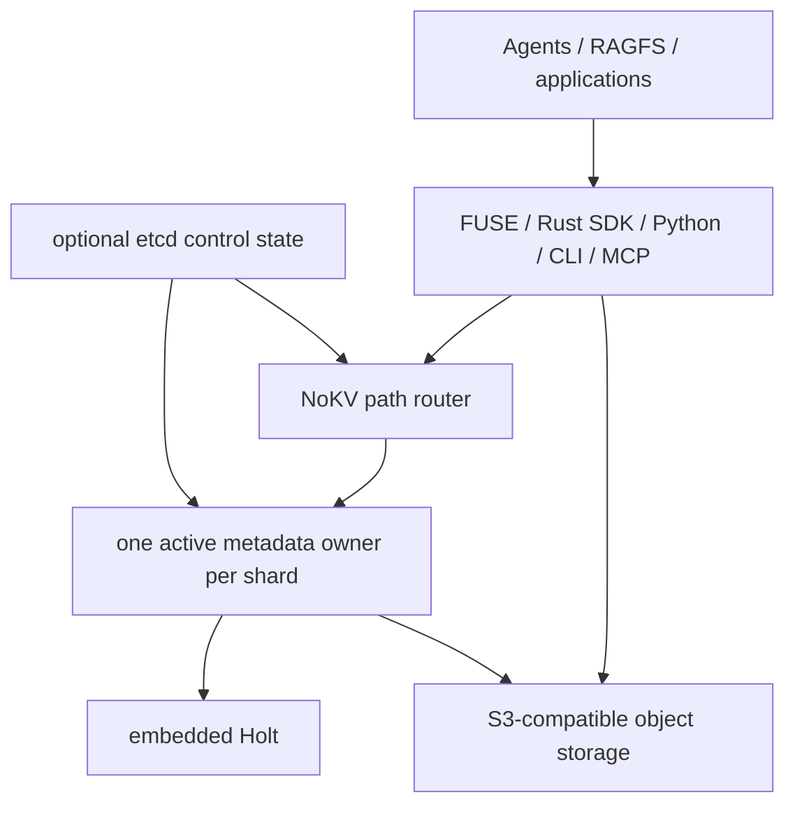

<!--
Copyright 2024-2026 The NoKV Authors.
SPDX-License-Identifier: Apache-2.0
-->

# Product Design

NoKV is a metadata control plane for agent workspaces. It gives agents and
tools a filesystem-shaped namespace over versioned workspace artifacts while
keeping immutable file bodies in S3-compatible object storage.

The product is not a generic distributed KV database, a trace database, a full
NAS replacement, or a raw S3 mount. Semantic memory, planning, validation, and
agent orchestration belong to the agent runtime. NoKV owns durable workspace
state and the metadata semantics needed to publish, inspect, snapshot, fork,
and recover that state.

## Product Boundary

```text
NoKV owns
  namespace truth and path routing
  inode/dentry and body-descriptor metadata
  shard-local MetadataCommand atomicity
  artifact/checkpoint publication points
  snapshots, typed watches, and CoW bindings
  provenance records explicitly supplied by applications
  history retention and object-reference GC policy

NoKV delegates
  file-body durability, replication, and availability to the object provider
  semantic retrieval and memory ranking to the context system
  task planning, validation, and orchestration to the agent runtime
  identity, policy, and credential distribution to the deployment today
  local NVMe residency to soft data-plane placement
```

NoKV determines which object generations are logically reachable and when an
unreferenced body is eligible for cleanup. The object provider performs the
physical write, replication, access control, and deletion.

## Why a Filesystem-Shaped Control Plane

Long-running agents produce directories of configs, logs, intermediate results,
checkpoints, reports, and evidence. A stable namespace lets runtimes address
those artifacts by path while NoKV supplies versioning and recovery semantics
below the interface.

The product value is durability and control, not a promise that every workload
uses fewer model tokens. Agent-interface token and cost measurements remain
useful historical evidence, but they are not the definition of NoKV.

## Holt's Role

Holt is the embedded metadata storage engine. It is not the distributed system
or the whole metadata service.

```text
NoKV metadata service
  filesystem and workspace semantics
  MetadataCommand validation
  path routing and shard ownership
  publication, snapshot, CoW, watch, and GC policy
  client, FUSE, MCP, and recovery contracts

Holt inside each owner
  ordered local metadata state
  ART prefix/range lookup
  atomic batch application
  WAL, checkpoint, and local recovery primitives
```

NoKV scales metadata by routing independent path ranges to independent
Holt-backed owners. Holt stays lightweight and shard-local; it does not run a
consensus protocol or own cluster membership.

## Reference Shape



The default path collapses `Router`, `Owner`, and `Holt` into one server. The
experimental fleet path resolves longest-prefix routes to multiple owners.

## Core Workspace Primitives

### Versioned publication

Clients upload immutable body blocks before submitting a metadata command. One
owning shard then publishes the new generation crash-atomically. NoKV does not
provide a transaction spanning multiple metadata shards.

### Stable historical views

A snapshot pins a version frontier and its retention floor for the duration of
the lease or another durable binding. Workflows must reuse the same snapshot
when several reads need one stable historical view. A snapshot does not stop
writes to the live workspace.

### CoW fork-to-restore

Restoring into a new same-shard workspace fork preserves the source, shares
immutable body blocks, and allows validation before consumers switch. Body
bytes are not copied, but namespace materialization can require work
proportional to entry count.

### Provenance metadata

Applications can record run manifests, body descriptors, digests, and explicit
relationships in the workspace. NoKV preserves and queries that metadata; it
does not infer semantic dependency graphs automatically.

### Workspace scoping

Configured roots and workspace ids constrain namespace access performed by an
adapter. This is useful application-level confinement, but it is not an
authentication, authorization, or security-grade tenant boundary.

## Capability Matrix

| Current default | Experimental on `main` | Next / hardening |
| --- | --- | --- |
| Single-node embedded Holt | Path-prefix sharding | Multi-machine failure qualification |
| Crash-consistent versioned publication | Fleet-aware Rust/CLI/FUSE routing | Enterprise small-file throughput qualification |
| S3-compatible immutable bodies | One active owner per shard | Production metadata HA mechanism |
| Rust SDK, CLI, FUSE, Python/fsspec | etcd lease/epoch fencing | Python fleet routing |
| Read-only seven-tool Agent MCP profile | Logical shared-log recovery | Online reshard/live subtree migration |
| Workbench MCP adapter | Local multi-process fleet smoke | Tenant identity, policy, and RBAC |
| Leased snapshots and typed watches | Library-level hot-tier data path | Live-workspace freeze |
| Same-shard CoW clone/restore |  | CSI and cache-agent deployment |
| Object-reference GC |  | Broader POSIX compatibility |

`Experimental` means code and focused local validation exist on `main`; it does
not mean the feature has a production support commitment or an enterprise SLA.

## Consistency and Distribution Principles

1. **Keep atomicity local.** The hot write path stays inside one Holt shard.
   Cross-shard path-pair operations fail explicitly instead of hiding a partial
   distributed transaction.
2. **Keep routing above Holt.** NoKV owns longest-prefix routes, owner leases,
   epochs, and recovery pointers. Holt owns local metadata application.
3. **Keep bytes immutable.** Published generations reference immutable body
   blocks, so cache placement can change without mutating namespace truth.
4. **Keep control state small.** The optional etcd backend stores shard-control
   records, not inode/dentry metadata or file bodies.
5. **Expose uncertainty.** A command that may have committed before an ACK loss
   is reconciled; clients must not assume every transport failure is a clean
   rejection.
6. **Make stable reads explicit.** Snapshot pinning, not an implicit promise
   about the live namespace, provides a stable multi-read view.

## Small-File Scale-Out Direction

The OpenViking/RAGFS integration provides a concrete small-file metadata
workload: many workspace paths and metadata objects need to be read and
published without turning Holt into a distributed database. The intended shape
is horizontal path sharding, with independent Holt work inside each shard and
shard-local crash-atomic publication.

This architecture is designed to scale metadata work in parallel. The project
does not yet claim enterprise-grade distributed throughput: multi-machine
hardening, topology disclosure, workload-specific benchmarking, and partner
qualification remain required evidence.

## Security and Deployment Boundary

Current deployments should treat the metadata RPC and configured object-store
credentials as trusted infrastructure. NoKV does not currently supply a
complete tenant identity, RBAC, TLS policy, or live-workspace freeze layer.
Object-store IAM, encryption, replication, and availability remain deployment
responsibilities.

These boundaries must remain explicit in public materials. Namespace scoping,
CoW divergence, and one-writer shard ownership must not be presented as
security isolation.

## Non-Goals for the Current System

- A distributed transaction across metadata shards.
- A consensus-replicated Holt instance.
- Transparent online resharding.
- Automatic semantic-memory ranking or agent planning.
- Automatic inference of provenance relationships not supplied by callers.
- A claim of production HA or enterprise throughput without reproducible
  multi-machine evidence.

See [Architecture](./architecture.md) for implementation details and
[Metadata Sharding and Recovery](./metadata-sharding-and-recovery.md) for the
experimental fleet and failover path.
